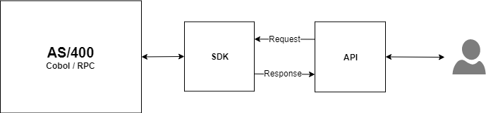
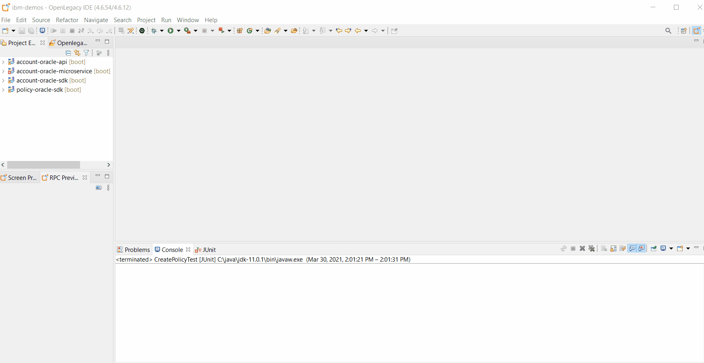
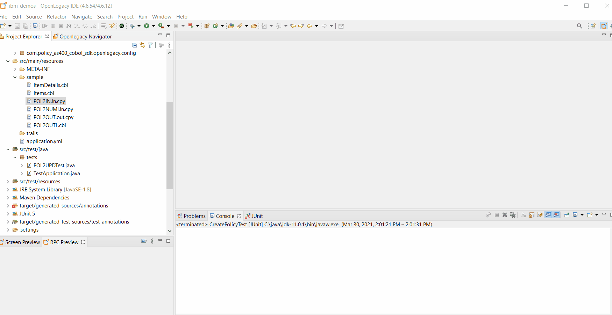
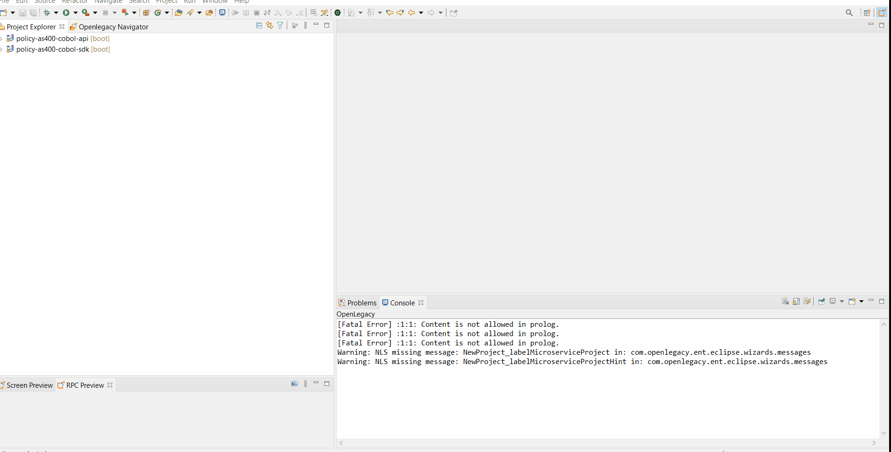

# Expose AS/400 COBOL Program as REST API

## Introduction

This demo shows how to generate Java models from **AS/400 RPC COBOL** sources using the OpenLegacy IDE, and how to expose them via **REST API**.

## Architecture



## Pre-Requirements

- OpenLegacy IDE 4.6.15 (Full installation including JDK and all Maven dependencies)
- Internet Connection

## Demo Definition

- Create a new SDK Project.
- Generate Java entities using OpenLegacy's built-in **COBOL Parser**.
- Develop and run unit tests on the fly.
- Test the connectivity and data retrieval from the **AS/400 Machine**.
- Create an API Project on the top of your SDK Project.

## Demo Resources

- [POL2IN.in.cpy](./assets/resources/POL2IN.in.cpy)
- [POL2OUT.out.cpy](./assets/resources/POL2OUT.out.cpy)
- [POL2NUMI.in.cpy](./assets/resources/POL2NUMI.in.cpy)
- [POL2NUMI.in.cpy](./assets/resources/POL2NUMI.in.cpy)
- [POL2OUTL.cbl](./assets/resources/POL2OUTL.cbl)


## Step 1 – Create a New SDK Project

> First, we will create a new SDK project using OpenLegacy IDE.
The SDK project allows easy access to legacy backends, using standard and easy to use Java code.

1. Open the New Project Wizard:
   - File → New → OpenLegacy SDK Project
2. Define the **Project Name** as `policy-as400-cobol-sdk`.
3. Click in the **Default Package** field, to automatically populate it.
4. Select **AS/400 RPC** as the backend and click Next.
5. Set the connection details to the backend with the following parameters:
   - **Host Name/IP:** `ibmi75.openlegacy.com`
   - **Code Page:** `37`
   - **Username:** `OPENLEGA1`
   - **Password:** `OPENLEGA`
6. Click **Finish**.



## Step 2 – Generate Java Model (Entity) from the COBOL File

> Now, we will create Java models out of a COBOL source file of the program we wish to expose.

1. Copy the COBOL resources from the - [resources](./assets/resources) folder into the `src/main/resources/sample` folder.
2. Generate Java modules:
   - **Get Policy**:
     - Select `POL2NUMI.in.cpy` and `POL2OUT.out.cpy`.
     - Right-click on the file → OpenLegacy → Generate Model.
     - **Entity Name** : `POL2GET`
     - **Execute Action Path**: `/QSYS.LIB/POLICY.LIB/POL2GET.pgm `
     - Check **Generate JUnit Test** checkbox.
     - Click **OK**.
   - **Get All Policies**:
     - Select `POL2OUTL.cbl`.
     - Right-click on the file → OpenLegacy → Generate Model.
     - **Entity Name** : `POL2LST`
     - **Execute Action Path**: `/QSYS.LIB/POLICY.LIB/POL2LST.pgm`
     - Check **Generate JUnit Test** checkbox.
     - Click **OK**.




## Step 3 – Create a JUnit Test

> OpenLegacy enables test-driven development by auto-generating test suites for each backend program (entity).
> We can extend this test suite with additional unit tests to validate our connectivity to the backend.
> The tests are auto-generated, and all you have to do is to provide JSON-format inputs and outputs to test againt the backend.

>_NOTE_: The tests should be run in the following order due to data dependencies, otherwise they won't pass. 
1. **Get All Policies**
   - Open `src/test/resources/mock/POL2UPDTest/test_poL2UPDTest_usecase_1.output.json`
   - Copy into it [get all policies output](./assets/resources/list-out.json).
   - Open `src/test/java/tests/POL2OUTLTest.java` and commenct the second test. 
   - Right-click on the test → run as → JunitTests. 
2. **Get Policy**
   - Open `src/test/resources/mock/POL2GETTest/test_poL2GETTest_usecase_1.input.json`
   - Copy into it [get policy input](./assets/resources/get-in.json).
   - Open `src/test/resources/mock/POL2GETTest/test_poL2GETTest_usecase_1.output.json`.
   - Copy into it [get policy output](./assets/resources/get-out.json).
   - Open `src/test/java/tests/POL2GETTest.java` and commenct the second test. 
   - Right-click on the test → run as → JunitTests. 


   If you followed all the steps correctly, the tests should pass.


## Step 4 – Create API from SDK

1. Open the New Project Wizard:
   - File → New → OpenLegacy API Project
2. Define the project name as `policy-as400-cobol-api`.
3. Click in the **Default Package** field, to automatically populate it.
4. Press Next and add the SDK project that was created in **Step 1**  as the reference project.
5. Remove the following dependencies from the pom.xml:
```XML
       <dependency>
            <groupId>org.springdoc</groupId>
            <artifactId>springdoc-openapi-security</artifactId>
        </dependency>
        <dependency>
            <groupId>org.openlegacy</groupId>
            <artifactId>openlegacy-security-client-jdbc</artifactId>
            <version>${openlegacy.version}</version>
        </dependency> 
        <dependency>
            <groupId>org.openlegacy</groupId>
            <artifactId>openlegacy-security-user-jdbc</artifactId>
            <version>${openlegacy.version}</version>
        </dependency>
```
6. Generate services from the SDK.
  - **Get All Policies**:
     - **Right-Click** on the **policy-as400-cobol-api** project → OpenLegacy → Generate API from SDK
     - Name the service `AllPolicies`
     - Select  `policyOut` from the `POL2OUTL` model as the output. 
     - **Click OK**
  - **Get Policy**:
     - **Right-Click** on the **policy-as400-cobol-api** project → OpenLegacy → Generate API from SDK
     - Name the service `GetPolicy`
     - Select `pol2getInput` from the `POL2GET` model as the input. 
     - Select `pol2getOutput` from the `POL2GET` model as the output. 
     - **Click OK**




## Step 5 - Run and Test your API

1. **Right-Click** on the **policy-as400-cobol-api** project → OpenLegacy → Run Application
2. Open the browser to http://localhost:8080/swagger
4. **Click** on `GET: /api/allpolicies` → Try it out → **Execute**.

You will get a list of all the policies. 


## Summary

In this demo we presented an end to end integration with **AS/400 RPC** using the Openlegacy IDE within just a couple of minutes. We started from a COBOL source of a program we wanted to expose and automatically generated a Java SDK that enables calling the underlying program. We then created a REST API utilizing the AS/400 RPC SDK.
We used the IDE to better model and design the API and showed how it works with a standard Swagger page.
