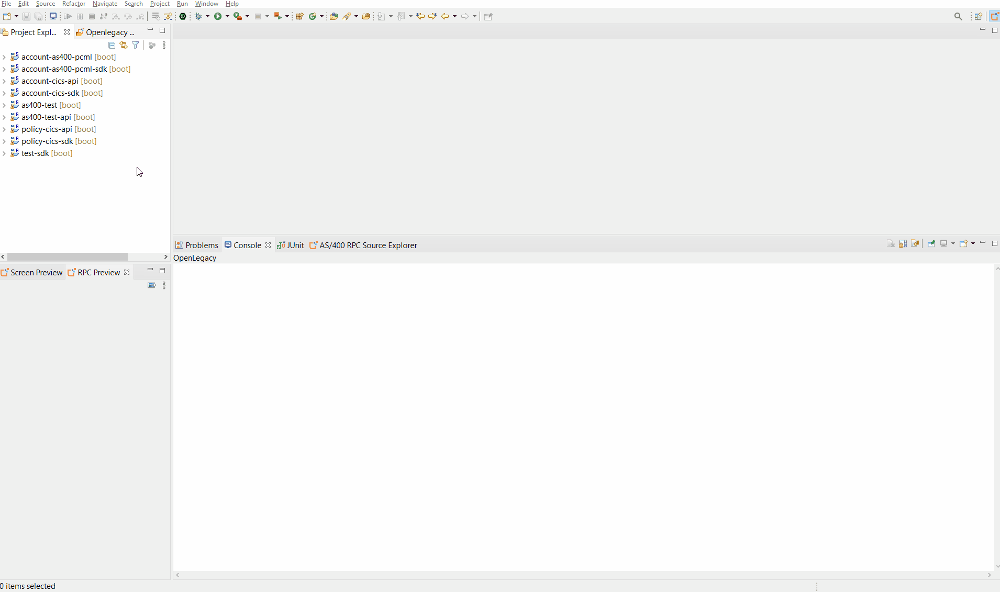

# AS/400 RPC Using PCML
## Intro
Fetch metadata used to pull the information from the AS/400 file system for easy display of its content.

## Pre-Requirements

- OpenLegacy IDE  (Full installation including JDK and all Maven dependencies)
- Internet Connection

## Demo Definition

- Create a new SDK Project.
- Generate Java model (Entity) from Pcml source file.
- Develop unit tests on the fly.
- Test the connectivity and data retrieval from the **AS400**.
- Test the SDK with JUnit and invoke the response.
- Create an API project based on your SDK project.

## Step By Step

## Step 1 - Create New SDK Project:
First, we will create a new SDK project using the OpenLegacy IDE. The purpose of the SDK project is to allow easy 		
access to legacy backends, using standard and easy to use Java code.

Create a new OpenLegacy AS/400 RPC project:
1.  Open the New Project Wizard:
    -  File → New → OpenLegacy SDK Project
2.  Define the **Project name** as `account-as400-pcml-sdk`.
3.  Select AS/400 RPC as the backend and click Next
4.  Enter the following AS/400 host credentials:
    -   Host Name/IP: `ibmi75.openlegacy.com`
    -   Code Page: 37
    -   User name: `OPENLEGA1`
    -   Password: `OPENLEGA`

   
## Step 2 - Generate Java Model (Entity) from the PCML File:

- Copy the following resource to your samples folder at `src/main/resources/sample` [Resources](./assets/resources)
- Go to application.yml and add the `externalLibs: - RMR2L1` property, this is needed to tell the jt400 which additional libraries to load.

### OpenAccount

1. Choose `OACTCS6X.pcml` -> Right click on one of the files -> Openlegacy -> Generate Model
2. In the **Execute Action Path** field, write the path of the pcml program (you can leave the default)
3. Mark **Generate JUnit test**
4. Press **Ok**.

### UpdateAccount

1. Choose `UACTCS6X.pcml` -> Right click on one of the files -> Openlegacy -> Generate Model
2. In the **Execute Action Path** field, write the path of the pcml program (you can leave the default)
3. Mark **Generate JUnit test**
4. Press **Ok**.

### GetAccount

1. Choose `GACTCS6X.pcml` -> Right click on one of the files -> Openlegacy -> Generate Model
2. In the **Execute Action Path** field, write the path of the pcml program (you can leave the default)
3. Mark **Generate JUnit test**
4. Press **Ok**.

### DeleteAccount

1. Choose `DACTCS6X.pcml` -> Right click on one of the files -> Openlegacy -> Generate Model
2. In the **Execute Action Path** field, write the path of the pcml program (you can leave the default)
3. Mark **Generate JUnit test**
4. Press **Ok**.

## Step 3 - Run JUnit test:

### Oactcs6x

1. Go to `/src/test/resources/mock/Oactcs6XTest/test_oactcs6XTest_usecase_1.input.json` and replace the JSON with:
- [Oactcs6x json Input](./assets/mock/Oactcs6XTest/test_oactcs6XTest_usecase_1.input.json)
2. Go to `/src/test/resources/mock/Oactcs6XTest/test_oactcs6XTest_usecase_1.output.json` and replace it with the expected output:
- [Oactcs6x json Output](./assets/mock/Oactcs6XTest/test_oactcs6XTest_usecase_1.output.json)
3. Go to `src/test/java/tests/Oactcs6XTest.java` and comment the second test. 
4. Right click on `Oactcs6XTest.java` -> run as JUnit test.   

### Uactcs6X

1. Go to `/src/test/resources/mock/Uactcs6XTest/test_uactcs6XTest_usecase_1.input.json` and replace the JSON with:
- [Uactcs6X json Input](./assets/mock/Uactcs6XTest/test_uactcs6XTest_usecase_1.input.json)
2. Go to `/src/test/resources/mock/Uactcs6XTest/test_uactcs6XTest_usecase_1.output.json` and replace it with the expected output:
- [Uactcs6X json Output](./assets/mock/Uactcs6XTest/test_uactcs6XTest_usecase_1.output.json)
3. Go to `src/test/java/tests/uactcs6XTest.java` and comment the second test. 
4. Right click on `uactcs6XTest.java` -> run as JUnit test.  

### Gactcs6X

1. Go to `/src/test/resources/mock/Gactcs6XTest/test_gactcs6XTest_usecase_1.input.json` and replace the JSON with:
- [Gactcs6X json Input](./assets/mock/Gactcs6XTest/test_gactcs6XTest_usecase_1.input.json)
2. Go to `/src/test/resources/mock/Uactcs6XTest/test_uactcs6XTest_usecase_1.output.json` and replace it with the expected output:
- [Gactcs6X json Output](./assets/mock/Gactcs6XTest/test_gactcs6XTest_usecase_1.output.json)
3. Go to `src/test/java/tests/gactcs6XTest.java` and comment the second test. 
4. Right click on `gactcs6XTest.java` -> run as JUnit test.   

### Dactcs6X

1. Go to `/src/test/resources/mock/Dactcs6XTest/test_uactcs6XTest_usecase_1.input.json` and replace the JSON with:
- [Dactcs6X json Input](./assets/mock/Dactcs6XTest/test_dactcs6XTest_usecase_1.input.json)
2. Go to `/src/test/resources/mock/Dactcs6XTest/test_dactcs6XTest_usecase_1.output.json` and replace it with the expected output:
- [Dactcs6X json Output](./assets/mock/Dactcs6XTest/test_dactcs6XTest_usecase_1.output.json)
3. Go to `src/test/java/tests/dactcs6XTest.java` and comment the second test. 
4. Right click on `dactcs6XTest.java` -> run as JUnit test.    

## Step 4 – Create APIs from SDK

1. Open the New Project Wizard:
   - File → New → OpenLegacy API Project
2. Define the **Project name** as `account-as400-pcml-api`.
3. Click at the **Default Package** field, to automatically populate it.
4. Press Next and add the SDK project that was created in **Step 1**  as the reference project.
5. Create services from the SDK's entities.

    ### Open Account

    **Right-Click** on the **policy-cics-api** project → OpenLegacy → Generate API from SDK
    - Name the service `OpenAccount`
    - Select from the `Oactcs6x` model all the properties as input 
    - Select from the `Oactcs6x` model all the properties as output
    - **Click OK**

    ### Update Account

    **Right-Click** on the **policy-cics-api** project → OpenLegacy → Generate API from SDK
    - Name the service `UpdateAccount`
    - Select from the `Uactcs6x` model all the properties as input 
    - Select from the `Uactcs6x` model all the properties as output
    - **Click OK**

    ### Get Account

    **Right-Click** on the **policy-cics-api** project → OpenLegacy → Generate API from SDK
    - Name the service `GetAccount`
    - Select from the `Gactcs6x` model all the properties as input 
    - Select from the `Gactcs6x` model all the properties as output
    - **Click OK**

    ### Delete Account

    **Right-Click** on the **policy-cics-api** project → OpenLegacy → Generate API from SDK
    - Name the service `DeleteAccount`
    - Select from the `Dactcs6x` model all the properties as input 
    - Select from the `Dactcs6x` model all the properties as output
    - **Click OK**

## Step 5 - Run and Test your API

1. **Right-Click** on the **Banking API** project → OpenLegacy → Run Application
2. Open the browser on http://localhost:8080/swagger
3. Authorize through **Oauth2**
   - **Client Id:** `client_id`
   - **Client Secret:** `client_secret`
4.  **Click** on the API we've created → Try it out

    ### OpenAccount
    - Set data as input from - [Oactcs6x json Input](./assets/mock/Oactcs6XTest/test_oactcs6XTest_usecase_1.input.json)
    - You should see a successful response returned from the PCML program `OACTCS6X`!

    ### UpdateAccount
    - Set data as input from - [Uactcs6x json Input](./assets/mock/Uactcs6XTest/test_uactcs6XTest_usecase_1.input.json)
    - You should see a successful response returned from the PCML program `UACTCS6X`!
    
    ### GetAccount
    - Set data as input from - [Gactcs6x json Input](./assets/mock/Gactcs6XTest/test_gactcs6XTest_usecase_1.input.json)
    - You should see a successful response returned from the PCML program `GACTCS6X`!
    
    ### DeleteAccount
    - Set data as input from - [Dactcs6x json Input](./assets/mock/Dactcs6XTest/test_dactcs6XTest_usecase_1.input.json)
    - You should see a successful response returned from the PCML program `DACTCS6X`!
    
    

## Summary

In this demo, we  presented an end to end integration with AS400 using the Openlegacy IDE in just a few minutes. We started from a PCML source of a program we wanted to expose and automatically generated a Java SDK that enables calling the underlying program. We then created a REST API utilizing the AS400 SDK. We used the IDE to better model and design the API and showed how it works with a standard Swagger page.

