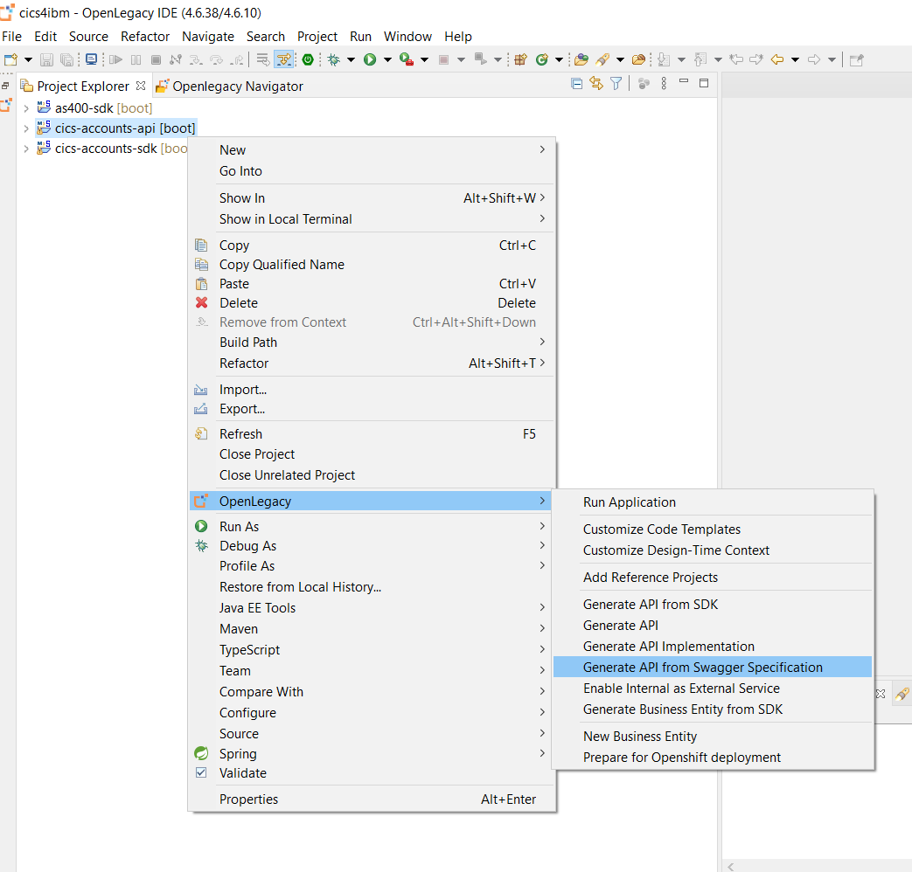
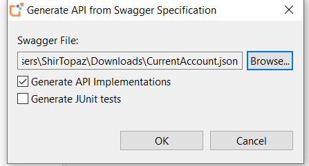
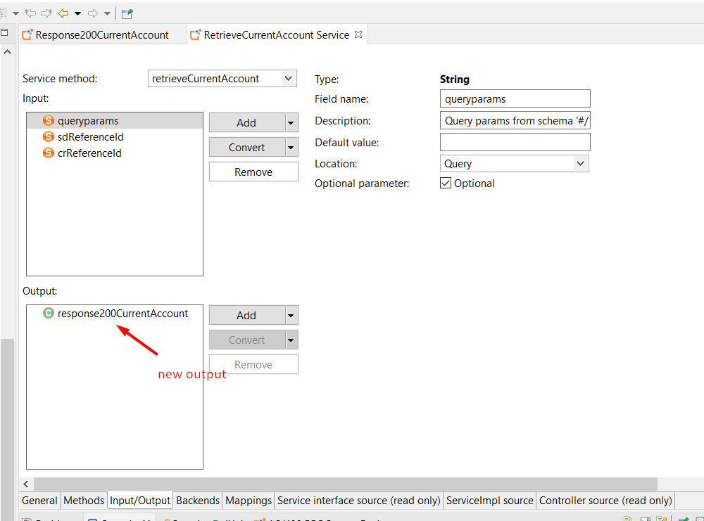
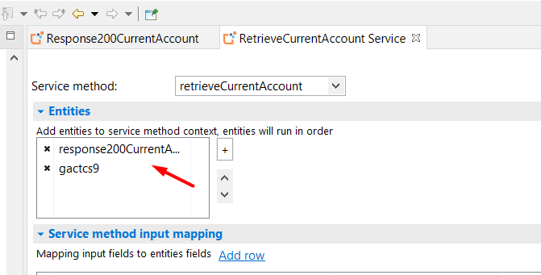
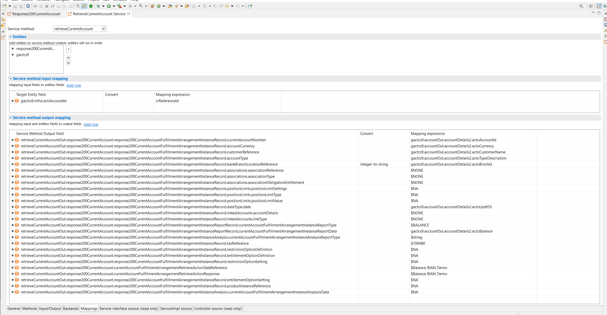

# Demo-Contract-First-BIAN

## Pre Requirements:
- Openlegacy IDE 4.6.10+ (Full installation including JDK 11 and all Maven dependencies)


## Demo Definitions:
Create an API from a BIAN contract on top of a CICS SDK. 

## Demo Resources
- [CurrentAccount.json](/assets/CurrentAccount.json)
- [GACTCS9.CBL](assets/GACTCS9.cbl)
### Step 1: Create New CICS SDK Project. 

>First, we will create a new SDK project using the OpenLegacy IDE. The purpose of the SDK project is to allow easy access to legacy backends, using standard and easy to use Java code.

1. Open the New Project Wizard:  

   - File → New → OpenLegacy SDK Project.
2. Define **Project Name** as **cics-account-sdk**
3. Click in the **Default Package** field, to automatically populate it.
4. Select Mainframe **CICS TS** as the backend and click **Next**.
5. Set the connection details to the backend with the following parameters:
    - **CICS Base URL:** `http://192.86.32.238`
    - **URI Map:** `ol/demos`
    - **CICS Port:** `12345`
    - **Code Page:** `CP037`
6. Click **Finish**

### Step 2 – Generate Java Model (Entity) from the COBOL Source
1. Copy the following resource to your samples folder at `src/main/resources/sample`:
    - - [GACTCS9.CBL](assets/GACTCS9.cbl)
2. **Right-Click** on the `GACTCS9.cbl` file → OpenLegacy → Generate Model
3. **Execution Path**: `GACTCS9`
4. Check **Generate JUnit Test checkbox**
5. Click **OK**
6. Please test the entity before continuing to the next step. 
(an example input  `"actiAccountId" : "11122234914"`)

### Step 3: Create API from BIAN.

1. Open the New Project Wizard:
   - File → New → OpenLegacy API Project
2. Define the **Project name** as `cics-account-api`.
3. Click in the **Default Package** field, to automatically populate it.
4. Press Next and add the SDK project that was created in **Step 1**  as the reference project.
5. Click **OK**
6. Right click on `cics-account-api` → openlegacy → Generate Sevice from Swagger Specification. 
7. Click **Browse** and choose `CurrentAccount.json` from its location. 
 

### Step 4: Map the Service Structure to the Entity Structure
In this demo, we will work on the `RetrieveCurrentAccountService.java`.

1. Create the response business entity (for version 4.6.10)
   - Go to `com.cics_account_api.openlegacy`.
   - Copy the following class: 

      <details>
      <summary>Click to expose Response200CurrentAccount.java</summary>
      
     ```

            package com.cics_account_api.openlegacy;
          
             import java.math.BigInteger;
             import java.math.BigDecimal;
             import java.util.List;
             import java.util.Date;
             import javax.validation.Valid;
             import javax.validation.constraints.Min;
             import javax.validation.constraints.Max;
             import javax.validation.constraints.DecimalMin;
             import javax.validation.constraints.DecimalMax;
             import javax.validation.constraints.Size;
             import javax.validation.constraints.NotNull;
             import org.openlegacy.core.annotations.BusinessEntity;
             import lombok.Getter;
             import lombok.Setter;
             import io.swagger.v3.oas.annotations.media.Schema;
             import com.fasterxml.jackson.annotation.JsonProperty;
             import com.fasterxml.jackson.annotation.JsonValue;
             
             @BusinessEntity
             @Getter
             @Setter
             @Schema(name = "Response200CurrentAccount")
             public class Response200CurrentAccount {
             
                 @Valid
                 @JsonProperty("currentAccountFulfillmentArrangementInstanceRecord")
                 private Response200CurrentAccountFulfillmentArrangementInstanceRecord response200CurrentAccountFulfillmentArrangementInstanceRecord;
             
                 @Valid
                 @JsonProperty("currentAccountFulfillmentArrangementRetrieveActionTaskRecord")
                 private Response200CurrentAccountFulfillmentArrangementRetrieveActionTaskRecord response200CurrentAccountFulfillmentArrangementRetrieveActionTaskRecord;
             
                 @Valid
                 @JsonProperty("currentAccountFulfillmentArrangementInstanceReportRecord")
                 private Response200CurrentAccountFulfillmentArrangementInstanceReportRecord response200CurrentAccountFulfillmentArrangementInstanceReportRecord;
             
                 @Valid
                 @JsonProperty("currentAccountFulfillmentArrangementInstanceAnalysis")
                 private Response200CurrentAccountFulfillmentArrangementInstanceAnalysis response200CurrentAccountFulfillmentArrangementInstanceAnalysis;
             
                 @JsonProperty("currentAccountFulfillmentArrangementRetrieveActionTaskReference")
                 private String currentAccountFulfillmentArrangementRetrieveActionTaskReference;
             
                 @JsonProperty("currentAccountFulfillmentArrangementRetrieveActionResponse")
                 private String currentAccountFulfillmentArrangementRetrieveActionResponse;
             }
        ```` 
</details>  
    
- Go to `src/main/java/com/cics_account_api/openlegacy/services/RetrieveCurrentAccountService.java`, and replace its output with the business entity we just created - `Response200CurrentAccount.java` .
Your Input/Output tab should look like this:



3. Go to the Mapping tab.
- Add the `Gactcs.java` and `Response200CurrentAccount.java` entities to the Entities section. 


- In the Input mapping, map `gactcs9.inPut.actiAccountId` to `crReferenceId`. 

- In the Output section, map the output fields as follows:

| Service Method Output field                                                                                                                              | Mapping Expression                                      |
| -------------------------------------------------------------------------------------------------------------------------------------------------------- | ------------------------------------------------------- |
| retrieveCurrentAccountOut.response200.currentAccountFulfillmentArrangementInstanceRecord.currentAccountNumber                                             | gactcs9.accountOut.accountDetails2.actoAccountId        |
| retrieveCurrentAccountOut.response200.currentAccountFulfillmentArrangementInstanceRecord.accountCurrency                                                  | gactcs9.accountOut.accountDetails2.actoCurrency         |
| retrieveCurrentAccountOut.response200.currentAccountFulfillmentArrangementInstanceRecord.customerReference                                                | gactcs9.accountOut.accountDetails2.actoCustomerName<br> |
| retrieveCurrentAccountOut.response200.currentAccountFulfillmentArrangementInstanceRecord.accountType                                                      | gactcs9.accountOut.accountDetails2.actoTypeDescription  |
| retrieveCurrentAccountOut.response200.currentAccountFulfillmentArrangementInstanceRecord.bankBranchLocationReference                                      | gactcs9.accountOut.accountDetails2.actoBrnchId          |
| retrieveCurrentAccountOut.response200.currentAccountFulfillmentArrangementInstanceRecord.associations.associationReference                                | $NONE                                                   |
| retrieveCurrentAccountOut.response200.currentAccountFulfillmentArrangementInstanceRecord.associations.associationType                                     | $NONE                                                   |
| retrieveCurrentAccountOut.response200.currentAccountFulfillmentArrangementInstanceRecord.associations.associationObligationEntitlement                    | $NONE                                                   |
| retrieveCurrentAccountOut.response200.currentAccountFulfillmentArrangementInstanceRecord.positionLimits.positionLimitSettings                             | $NA                                                     |
| retrieveCurrentAccountOut.response200.currentAccountFulfillmentArrangementInstanceRecord.positionLimits.positionLimitType                                 | $NA                                                     |
| retrieveCurrentAccountOut.response200.currentAccountFulfillmentArrangementInstanceRecord.positionLimits.positionLimitValue                                | $NA                                                     |
| retrieveCurrentAccountOut.response200.currentAccountFulfillmentArrangementInstanceRecord.dateType.date                                                    | gactcs9.accountOut.accountDetails2.actoUpdtDt<br>       |
| retrieveCurrentAccountOut.response200.currentAccountFulfillmentArrangementInstanceRecord.linkedAccounts.accountDetails                                    | $NONE                                                   |
| retrieveCurrentAccountOut.response200.currentAccountFulfillmentArrangementInstanceRecord.linkedAccounts.linkType                                          | $NONE                                                   |
| response200CurrentAccount.response200CurrentAccountFulfillmentArrangementInstanceReportRecord.currentAccountFulfillmentArrangementInstanceReportType     | $BALANCE                                                |
| response200CurrentAccount.response200CurrentAccountFulfillmentArrangementInstanceReportRecord.currentAccountFulfillmentArrangementInstanceReportData     | gactcs9.accountOut.accountDetails2.actoBalance          |
| response200CurrentAccount.response200CurrentAccountFulfillmentArrangementInstanceAnalysis.currentAccountFulfillmentArrangementInstanceAnalysisReportType | $string                                                 |
| retrieveCurrentAccountOut.response200.currentAccountFulfillmentArrangementInstanceRecord.taxReference                                                     | $709,480                                                |
| retrieveCurrentAccountOut.response200.currentAccountFulfillmentArrangementInstanceRecord.restrictionOptionDefinition                                      | $NA                                                     |
| retrieveCurrentAccountOut.response200.currentAccountFulfillmentArrangementInstanceRecord.entitlementOptionDefinition                                      | $NA                                                     |
| retrieveCurrentAccountOut.response200.currentAccountFulfillmentArrangementInstanceRecord.restrictionOptionSetting                                         | $NA                                                     |
| response200CurrentAccount.currentAccountFulfillmentArrangementRetrieveActionTaskReference                                                                | $Balance BIAN Demo                                      |
| response200CurrentAccount.currentAccountFulfillmentArrangementRetrieveActionResponse                                                                     | $Balance BIAN Demo                                      |
| retrieveCurrentAccountOut.response200.currentAccountFulfillmentArrangementInstanceRecord.entitlementOptionSetting                                         | $NA                                                     |
| retrieveCurrentAccountOut.response200.currentAccountFulfillmentArrangementInstanceRecord.productInstanceReference                                         | $NA                                                     |
| response200CurrentAccount.response200CurrentAccountFulfillmentArrangementInstanceAnalysis.currentAccountFulfillmentArrangementInstanceAnalysisData       | $NA                                                     |                  

The mapping tab should look like this:




### Step 5: Test the API

1. Right-click on the API project → Run Application. 
2. Go to → http://localhost:8080/swagger-ui/index.html?configUrl=/swagger/swagger.json/swagger-config#/retrieve/retrieveCurrentAccount
3. Click **Try it out**
4. Fill the input fields:  
   -  **sdReferenceId** : 1
   - **crReferenceId**: 11122234914
   - You should see a successful response: 
   
```
    {
    "currentAccountFulfillmentArrangementInstanceRecord": {
    "productInstanceReference": "NA",
    "currentAccountNumber": "11122234914",
    "customerReference": "ROBERT SMITH",
    "bankBranchLocationReference": "1122",
    "accountType": "Savings Account",
    "accountCurrency": "USD",
    "taxReference": "709480",
    "entitlementOptionDefinition": "NA",
    "entitlementOptionSetting": "NA",
    "restrictionOptionDefinition": "NA",
    "restrictionOptionSetting": "NA",
    "associations": {
      "associationType": "NONE",
      "associationObligationEntitlement": "NONE",
      "associationReference": "NONE"
    },
    "linkedAccounts": {
      "linkType": "NONE",
      "accountDetails": "NONE"
    },
    "positionLimits": {
      "positionLimitType": "NA",
      "positionLimitSettings": "NA",
      "positionLimitValue": "NA"
    },
    "dateType": {
      "date": "20210221"
    }
  },
  "currentAccountFulfillmentArrangementRetrieveActionTaskRecord": null,
  "currentAccountFulfillmentArrangementInstanceReportRecord": {
    "currentAccountFulfillmentArrangementInstanceReportData": "44835.28",
    "currentAccountFulfillmentArrangementInstanceReportType": "BALANCE",
    "currentAccountFulfillmentArrangementInstanceReport": null
  },
  "currentAccountFulfillmentArrangementInstanceAnalysis": {
    "currentAccountFulfillmentArrangementInstanceAnalysisData": "NA",
    "currentAccountFulfillmentArrangementInstanceAnalysisReportType": "string",
    "currentAccountFulfillmentArrangementInstanceAnalysisReport": null
  },
  "currentAccountFulfillmentArrangementRetrieveActionTaskReference": "Balance BIAN Demo",
  "currentAccountFulfillmentArrangementRetrieveActionResponse": "Balance BIAN Demo"
}

```
