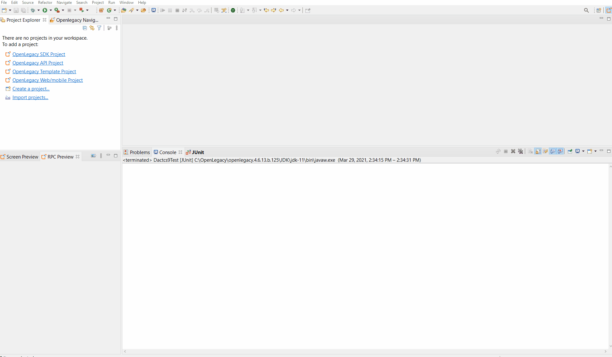
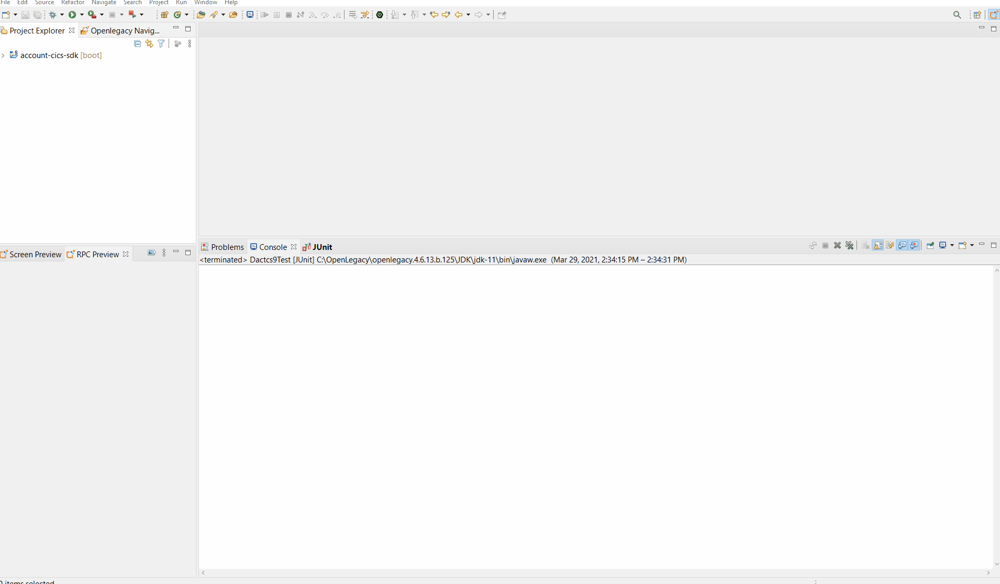
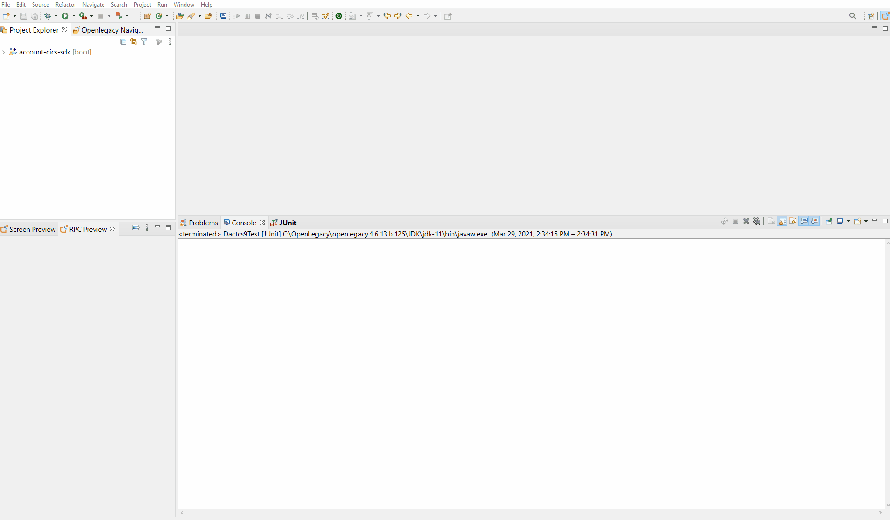
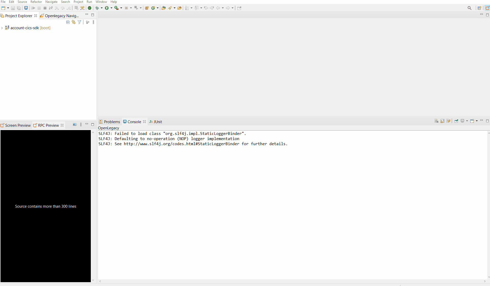
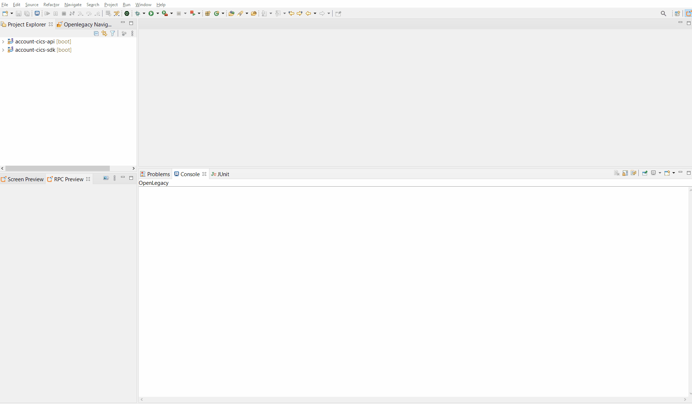

# REST API on top of Mainframe CICS
 
The following demonstrate how to create an API for retrieval of bank accounts.

## Pre-Requirements

- OpenLegacy IDE 4.6.12 (Full installation including JDK and all Maven dependencies).
- Internet Connection

## Demo Definition

- Creation of a new SDK Project.
- Generating Java Entities from **Cobol sources**
- Develop and run unit tests on the fly.
- Test the connectivity and data retrieval from the **Mainframe CICS Program**.
- Creation of an API Project on the top of your SDK Project.
  
## Demo Resources

- [Cobol Resources](./assets/resources/)

## Step 1 – Create a New SDK Project

> First, we will create a new SDK project using the OpenLegacy IDE.
The purpose of the SDK project is to allow easy access to legacy backends, using standard and easy to use Java code.

1. Open the New Project Wizard:
   - File → New → OpenLegacy SDK Project
2. Define the **Project Name** as **account-cics-sdk**
3. Click at the **Default Package** field, to automatically fill it up.
4. Select **Mainframe CICS TS** as the backend and click **Next**
5. Set the connection details to the backend based on following parameters:
    - **CICS Base URL:** `http://mainframe.openlegacy.com`
    - **URI Map:** `ol/demos`
    - **CICS Port:** `12345`
    - **Code Page:** `CP037`
6. Click **Finish**

## Step 2 – Generate Java Model (Entity) from the Cobol Sources

> Now, we will create Java models out of our copy books and cobol files we wish to expose.

- Copy the following resource to your samples folder at `src/main/resources/sample` [Resources](./assets/resources)

### For The Copybooks

- Go to **design-time.properties** -> set `generateCopyAsEntity=true`

#### Get Account

1. Choose both files(`GACTCS9.out.cpy`, `GACTCS9.in.cpy`) -> Right click on one of the files -> Openlegacy -> Generate Model
2. Type in **Transaction:** `GACTCS9` 
3. Mark **Generate JUnit test**
4. Press **Ok**.

#### List Account

1. Choose both files(`LACTCS9.out.cpy`, `LACTCS9.in.cpy`) -> Right click on one of the files -> Openlegacy -> Generate Model
2. Type in **Transaction:** `LACTCS9` 
3. Mark **Generate JUnit test**
4. Press **Ok**.

#### Delete Account

1. Choose both files(`DACTCS9.out.cpy`, `DACTCS9.in.cpy`) -> Right click on one of the files -> Openlegacy -> Generate Model
2. Type in **Transaction:** `DACTCS9` 
3. Mark **Generate JUnit test**
4. Press **Ok**.

### For The Cobol Files

#### Reset Account

1. **Right-Click** on the `RACTCS9.cbl` file → OpenLegacy → Generate Model
2. **Execution Path**: `RACTCS9`
3. Check **Generate JUnit Test checkbox**
4. Click **OK**

#### Update Account

1. **Right-Click** on the `UACTCS9.cbl` file → OpenLegacy → Generate Model
2. **Execution Path**: `UACTCS9`
3. Check **Generate JUnit Test checkbox**
4. Click **OK**

#### Open Account

1. **Right-Click** on the `OACTCS9.cbl` file → OpenLegacy → Generate Model
2. **Execution Path**: `OACTCS9`
3. Check **Generate JUnit Test checkbox**
4. Click **OK**

## Step 3 – Create a JUnit Test

> OpenLegacy enables test-driven development by auto-generating test suites for each backend program (entities).
We can extend this test suite with additional unit tests to validate our connectivity to the backend.

### Ractcs9

1. Go to `/src/test/resources/mock/Ractcs9Test/test_ractcs9Test_usecase_1.input.json` and replace the JSON with:
- [Ractcs9 json Input](./assets/mock/Ractcs9Test/test_ractcs9Test_usecase_1.input.json)
2. Go to `/src/test/resources/mock/Ractcs9Test/test_ractcs9Test_usecase_1.output.json` and repace it with the expected output:
- [Ractcs9 json Output](./assets/mock/Ractcs9Test/test_ractcs9Test_usecase_1.output.json)
3. Go to `src/test/java/tests/Ractcs9Test.java` and comment the second test. 
4. Right click on `Ractcs9Test.java` -> run as JUnit test.   

### Lactcs9

1. Go to `/src/test/resources/mock/Lactcs9Test/test_lactcs9Test_usecase_1.input.json` and replace the JSON with:
- [Lactcs9 json Input](./assets/mock/Lactcs9Test/test_lactcs9Test_usecase_1.input.json)
2. Go to `/src/test/resources/mock/Lactcs9Test/test_lactcs9Test_usecase_1.output.json` and repace it with the expected output:
- [Lactcs9 json Output](./assets/mock/Lactcs9Test/test_lactcs9Test_usecase_1.output.json)
3. Go to `src/test/java/tests/Lactcs9Test.java` and comment the second test. 
4. Right click on `Lactcs9Test.java` -> run as JUnit test.   

### Oactcs9

1. Go to `/src/test/resources/mock/Oactcs9Test/test_oactcs9Test_usecase_1.input.json` and replace the JSON with:
- [Oactcs9 json Input](./assets/mock/Ractcs9Test/test_oactcs9Test_usecase_1.input.json)
2. Go to `/src/test/resources/mock/Oactcs9Test/test_oactcs9Test_usecase_1.output.json` and repace it with the expected output:
- [Oactcs9 json Output](./assets/mock/Oactcs9Test/test_oactcs9Test_usecase_1.output.json)
3. Go to `src/test/java/tests/Oactcs9Test.java` and comment the second test. 
4. Right click on `Oactcs9Test.java` -> run as JUnit test.   

### Gactcs9

1. Go to `/src/test/resources/mock/Gactcs9Test/test_gactcs9Test_usecase_1.input.json` and replace the JSON with:
- [Gactcs9 json Input](./assets/mock/Gactcs9Test/test_gactcs9Test_usecase_1.input.json) 
2. Go to `/src/test/resources/mock/Gactcs9Test/test_gactcs9Test_usecase_1.output.json` and repace it with the expected output:
- [Gactcs9 json Output](./assets/mock/Gactcs9Test/test_gactcs9Test_usecase_1.output.json)
3. Go to `src/test/java/tests/Gactcs9Test.java` and comment the second test. 
4. Right click on `Gactcs9Test.java` -> run as JUnit test.   

### Uactcs9

1. Go to `/src/test/resources/mock/Uactcs9Test/test_uactcs9Test_usecase_1.input.json` and replace the JSON with:
- [Uactcs9 json Input](./assets/mock/Uactcs9Test/test_uactcs9Test_usecase_1.input.json)
2. Go to `/src/test/resources/mock/Uactcs9Test/test_uactcs9Test_usecase_1.output.json` and repace it with the expected output:
- [Uactcs9 json Output](./assets/mock/Uactcs9Test/test_uactcs9Test_usecase_1.output.json)
3. Go to `src/test/java/tests/Uactcs9Test.java` and comment the second test. 
4. Right click on `Uactcs9Test.java` -> run as JUnit test.   

### Dactcs9

1. Go to `/src/test/resources/mock/Dactcs9Test/test_dactcs9Test_usecase_1.input.json` and replace the JSON with:
- [Dactcs9 json Input](./assets/mock/Dactcs9Test/test_dactcs9Test_usecase_1.input.json)
2. Go to `/src/test/resources/mock/Dactcs9Test/test_dactcs9Test_usecase_1.output.json` and repace it with the expected output:
- [Dactcs9 json Output](./assets/mock/Dactcs9Test/test_dactcs9Test_usecase_1.output.json)
3. Go to `src/test/java/tests/Dactcs9Test.java` and comment the second test. 
4. Right click on `Dactcs9Test.java` -> run as JUnit test.   

If you followed the steps above the test should pass successfully. 

## Step 4 – Create APIs from SDK

1. Open the New Project Wizard:
   - File → New → OpenLegacy API Project
2. Define the **Project name** as `account-cics-api`.
3. Click at the **Default Package** field, to automatically fill it up.
4. Press Next and add the SDK project that was created in **Step 1**  as the reference project.
5. Create services from the SDK's entities.

    ### Reset Account Service

    **Right-Click** on the **account-cics-api** project → OpenLegacy → Generate API from SDK
    - Name the service `ResetAccount`
    - Select from the `Ractcs9` model as input
    - Select from the `Ractcs9` model as output
    - **Click OK**

    ### List Account Service

    **Right-Click** on the **account-cics-api** project → OpenLegacy → Generate API from SDK
    - Name the service `ListAccount`
    - Leave the input empty.
    - Select from the `Lactcs9` model the `lactcs9Output` as output
    - **Click OK**

    ### Open Account Service

    **Right-Click** on the **account-cics-api** project → OpenLegacy → Generate API from SDK
    - Name the service `OpenAccount`
    - Select from the `Oactcs9` model as input
    - Select from the `Oactcs9` as output
    - **Click OK**

    ### Get Account Service

    **Right-Click** on the **account-cics-api** project → OpenLegacy → Generate API from SDK
    - Name the service `GetAccount`
    - Select from the `Gactcs9` model the `gactcs9Input` as input
    - Select from the `Gactcs9` model the `gactcs9Output` as output
    - **Click OK**

    ### Update Account Service

    **Right-Click** on the **account-cics-api** project → OpenLegacy → Generate API from SDK
    - Name the service `UpdateAccount`
    - Select from the `Uactcs9` model as input
    - Select from the `Uactcs9` model as output
    - **Click OK**

    ### Delete Account Service

    **Right-Click** on the **account-cics-api** project → OpenLegacy → Generate API from SDK
    - Name the service `DeleteAccount`
    - Select from the `Dactcs9` model the `dactcs9Input` as input
    - Select from the `Dactcs9` model the `dactcs9Output` as input
    - **Click OK**

## Step 5 - Run and Test your API

1. **Right-Click** on the **account API** project → OpenLegacy → Run Application
2. Open the browser on http://localhost:8080/swagger
3. Authorize through **Oauth2**
   - **Client Id:** `client_id`
   - **Client Secret:** `client_secret`
4.  **Click** on the API we've created → Try it out

    ### ResetAccount
    - Set data as input from - [Ractcs9 json Input](./assets/mock/Ractcs9Test/test_ractcs9Test_usecase_1.input.json)
    - You should see successful respond returned directly from the mainframe CICS program `RACTCS9`!

    ### ListAccount
    - Set data as input from - [Lactcs9 json Input](./assets/mock/Lactcs9Test/test_lactcs9Test_usecase_1.input.json)
    - You should see successful respond returned directly from the mainframe CICS program `LACTCS9`!
    
    ### OpenAccount
    - Set data as input from - [Oactcs9 json Input](./assets/mock/Oactcs9Test/test_oactcs9Test_usecase_1.input.json)
    - You should see successful respond returned directly from the mainframe CICS program `OACTCS9`!
    
    ### GetAccount
    - Set data as input from - [Gactcs9 json Input](./assets/mock/Gactcs9Test/test_gactcs9Test_usecase_1.input.json)
    - You should see successful respond returned directly from the mainframe CICS program `GACTCS9`!
    
    ### UpdateAccount
    - Set data as input from - [Uactcs9 json Input](./assets/mock/Uactcs9Test/test_uactcs9Test_usecase_1.input.json)
    - You should see successful respond returned directly from the mainframe CICS program `UACTCS9`!
    
    ### DeleteAccount
    - Set data as input from - [Dactcs9 json Input](./assets/mock/Dactcs9Test/test_dactcs9Test_usecase_1.input.json)
    - You should see successful respond returned directly from the mainframe CICS program `DACTCS9`!
    

 

# Summary

In this demo we have presented an end to end integration with Mainframe CICS using Openlegacy IDE within just a couple of minutes.
We have started from a COBOL source of a program we wanted to expose and automatically generated Java SDK that enables calling the underlying program, then we have presented the creation of a REST API utilizing the Mainframe CICS SDK.
We used the IDE to better model and design the API and showed how it works with a standard Swaager page.
