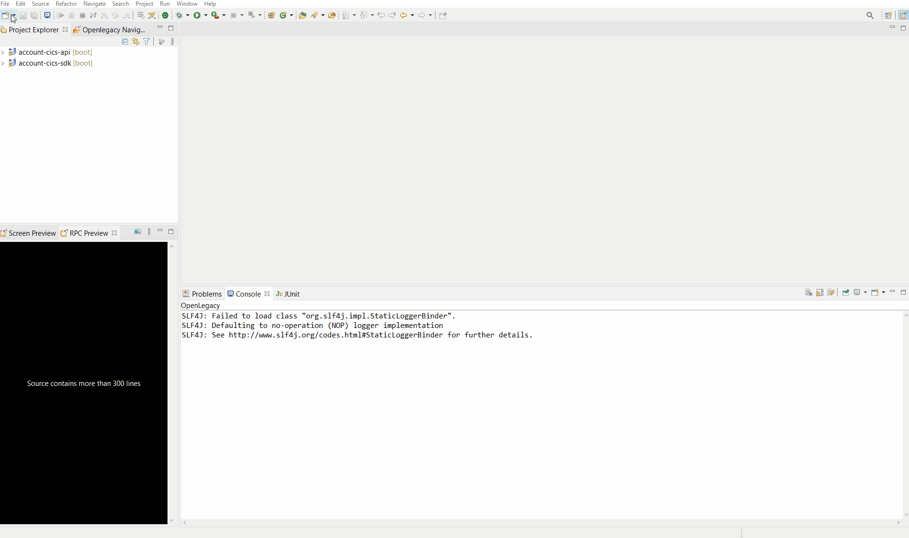
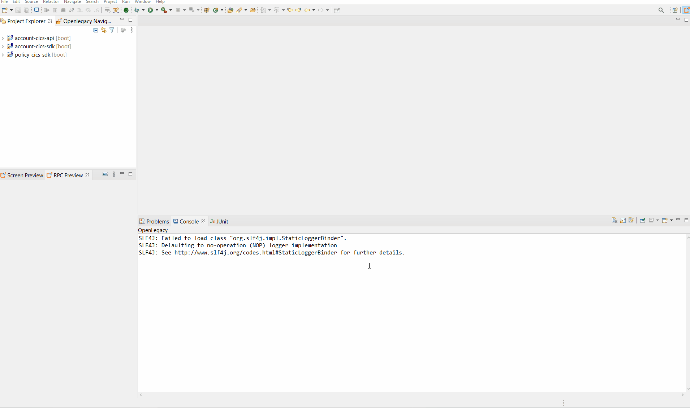
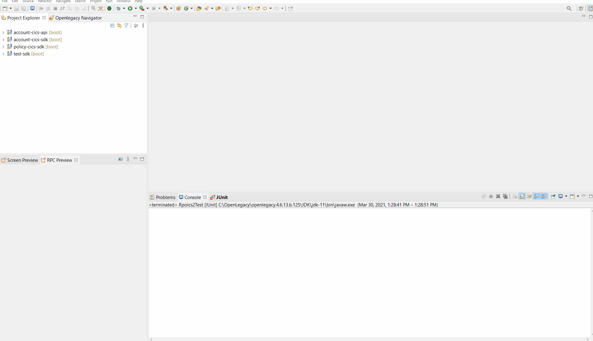
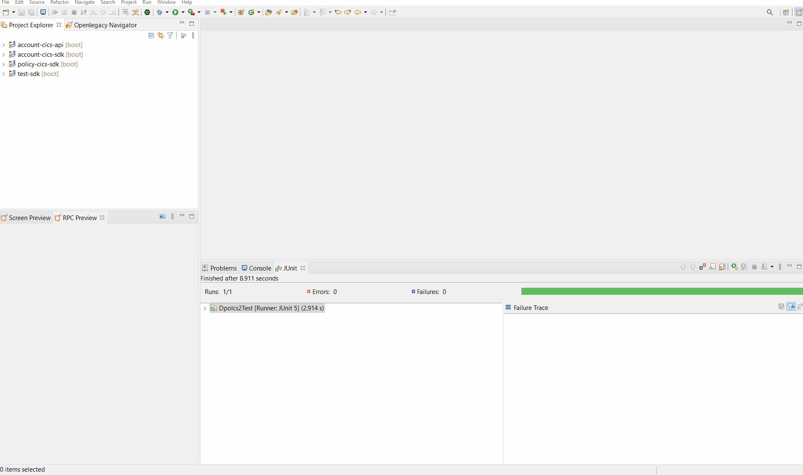
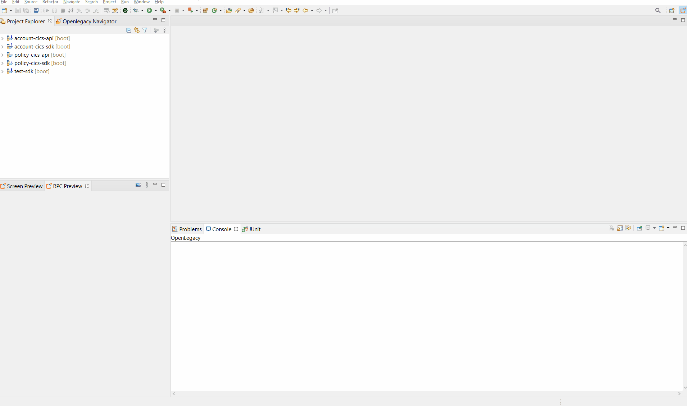

# REST API on top of Mainframe CICS
 
The following demonstrate how to create an API for retrieval of policy accounts.

## Pre-Requirements

- OpenLegacy IDE 4.6.12 (Full installation including JDK and all Maven dependencies).
- Internet Connection

## Demo Definition

- Creation of a new SDK Project.
- Generating Java Entities from **Cobol sources**
- Develop and run unit tests on the fly.
- Test the connectivity and data retrieval from the **Mainframe CICS Program**.
- Creation of an API Project on the top of your SDK Project.
  
## Demo Resources

- [Copybook Resources](./assets/resources/)

## Step 1 – Create a New SDK Project

> First, we will create a new SDK project using the OpenLegacy IDE.
The purpose of the SDK project is to allow easy access to legacy backends, using standard and easy to use Java code.

1. Open the New Project Wizard:
   - File → New → OpenLegacy SDK Project
2. Define the **Project Name** as **policy-cics-sdk**
3. Click at the **Default Package** field, to automatically fill it up.
4. Select **Mainframe CICS TS** as the backend and click **Next**
5. Set the connection details to the backend based on following parameters:
    - **CICS Base URL:** `http://mainframe.openlegacy.com`
    - **URI Map:** `ol/demos`
    - **CICS Port:** `12345`
    - **Code Page:** `CP037`
6. Click **Finish**

## Step 2 – Generate Java Model (Entity) from the Copy Book Sources

> Now, we will create Java models out of our copy books files we wish to expose.

- Copy the following resource to your samples folder at `src/main/resources/sample` [Resources](./assets/resources)
- Go to **design-time.properties** -> set `generateCopyAsEntity=true`

#### Reset Account

1. Choose `RPOLCS2.cpy` -> Right click on one of the file -> Openlegacy -> Generate Model
2. **Execution Path**: `RPOLCS2` 
3. Mark **Generate JUnit test**
4. Press **Ok**.

#### List Account

1. Choose both files(`LPOLCS2.out.cpy`, `LPOLCS2.in.cpy`) -> Right click on one of the files -> Openlegacy -> Generate Model
2. Type in **Transaction:** `LPOLCS2` 
3. Mark **Generate JUnit test**
4. Press **Ok**.

#### Open Account

1. Choose both files(`OPOLCS2.out.cpy`, `OPOLCS2.in.cpy`) -> Right click on one of the files -> Openlegacy -> Generate Model
2. Type in **Transaction:** `OPOLCS2` 
3. Mark **Generate JUnit test**
4. Press **Ok**.

#### Get Account

1. Choose both files(`GOPOLCS2.out.cpy`, `GOPOLCS2.in.cpy`) -> Right click on one of the files -> Openlegacy -> Generate Model
2.  **Execution Path**: `GOPOLCS2`
3. Mark **Generate JUnit test**
4. Press **Ok**.

#### Update Account

1. Choose both files(`UOPOLCS2.out.cpy`, `UOPOLCS2.in.cpy`) -> Right click on one of the files -> Openlegacy -> Generate Model
2.  **Execution Path**: `UOPOLCS2`
3. Mark **Generate JUnit test**
4. Press **Ok**.

#### Delete Account

1. Choose both files(`DOPOLCS2.out.cpy`, `DOPOLCS2.in.cpy`) -> Right click on one of the files -> Openlegacy -> Generate Model
2.  **Execution Path**: `DOPOLCS2`
3. Mark **Generate JUnit test**
4. Press **Ok**.

## Step 3 – Create a JUnit Test

> OpenLegacy enables test-driven development by auto-generating test suites for each backend program (entities).
We can extend this test suite with additional unit tests to validate our connectivity to the backend.

### Rpolcs2

1. Go to `/src/test/resources/mock/Rpolcs2Test/test_rpolcs2Test_usecase_1.input.json` and replace the JSON with:
- [Rpolcs2 json Input](./assets/mock/Rpolcs2Test/test_rpolcs2Test_usecase_1.input.json)
2. Go to `/src/test/resources/mock/Rpolcs2Test/test_rpolcs2Test_usecase_1.output.json` and repace it with the expected output:
- [Rpolcs2 json Output](./assets/mock/Rpolcs2Test/test_rpolcs2Test_usecase_1.output.json)
3. Go to `src/test/java/tests/Rpolcs2Test.java` and comment the second test. 
4. Right click on `Rpolcs2Test.java` -> run as JUnit test.   

### Lpolcs2

1. Go to `/src/test/resources/mock/Lpolcs2Test/test_lpolcs2Test_usecase_1.input.json` and replace the JSON with:
- [Lpolcs2 json Input](./assets/mock/Lpolcs2Test/test_lpolcs2Test_usecase_1.input.json)
2. Go to `/src/test/resources/mock/Lpolcs2Test/test_lpolcs2Test_usecase_1.output.json` and repace it with the expected output:
- [Lpolcs2 json Output](./assets/mock/Lpolcs2Test/test_lpolcs2Test_usecase_1.output.json)
3. Go to `src/test/java/tests/Lpolcs2Test.java` and comment the second test. 
4. Right click on `Lpolcs2Test.java` -> run as JUnit test.   

### Opolcs2

1. Go to `/src/test/resources/mock/Opolcs2/test_opolcs2Test_usecase_1.input.json` and replace the JSON with:
- [Opolcs2 json Input](./assets/mock/Opolcs2/test_opolcs2Test_usecase_1.input.json)
2. Go to `/src/test/resources/mock/Opolcs2Test/test_opolcs2Test_usecase_1.output.json` and repace it with the expected output:
- [Opolcs2 json Output](./assets/mock/Opolcs2Test/test_opolcs2Test_usecase_1.output.json)
3. Go to `src/test/java/tests/Opolcs2Test.java` and comment the second test. 
4. Right click on `Opolcs2Test.java` -> run as JUnit test.   

### Gpolcs2

1. Go to `/src/test/resources/mock/Gpolcs2/test_gpolcs2Test_usecase_1.input.json` and replace the JSON with:
- [Gpolcs2 json Input](./assets/mock/Gpolcs2Test/test_gpolcs2Test_usecase_1.input.json) 
2. Go to `/src/test/resources/mock/Gpolcs2Test/test_gactcs9Test_usecase_1.output.json` and repace it with the expected output:
- [Gpolcs2 json Output](./assets/mock/Gpolcs2Test/test_gpolcs2Test_usecase_1.output.json)
3. Go to `src/test/java/tests/Gpolcs2Test.java` and comment the second test. 
4. Right click on `Gpolcs2Test.java` -> run as JUnit test.   

### Upolcs2

1. Go to `/src/test/resources/mock/Upolcs2/test_upolcs2Test_usecase_1.input.json` and replace the JSON with:
- [Upolcs2 json Input](./assets/mock/Uactcs9Test/test_upolcs2_usecase_1.input.json)
2. Go to `/src/test/resources/mock/Upolcs2/test_upolcs2_usecase_1.output.json` and repace it with the expected output:
- [Upolcs2 json Output](./assets/mock/Uactcs9Test/test_upolcs2_usecase_1.output.json)
3. Go to `src/test/java/tests/Upolcs2.java` and comment the second test. 
4. Right click on `Upolcs2Test.java` -> run as JUnit test.   

### Dpolcs2

1. Go to `/src/test/resources/mock/Dpolcs2Test/test_dpolcs2Test_usecase_1.input.json` and replace the JSON with:
- [Dpolcs2 json Input](./assets/mock/Dpolcs2Test/test_dpolcs2Test_usecase_1.input.json)
2. Go to `/src/test/resources/mock/Dpolcs2Test/test_dpolcs2Test_usecase_1.output.json` and repace it with the expected output:
- [Dpolcs2 json Output](./assets/mock/Dpolcs2Test/test_dpolcs2Test_usecase_1.output.json)
3. Go to `src/test/java/tests/Dpolcs2Test.java` and comment the second test. 
4. Right click on `Dpolcs2Test.java` -> run as JUnit test.   

If you followed the steps above the test should pass successfully. 

## Step 4 – Create APIs from SDK

1. Open the New Project Wizard:
   - File → New → OpenLegacy API Project
2. Define the **Project name** as `policy-cics-api`.
3. Click at the **Default Package** field, to automatically fill it up.
4. Press Next and add the SDK project that was created in **Step 1**  as the reference project.
5. Create services from the SDK's entities.

    ### Reset Policy Service

    **Right-Click** on the **policy-cics-api** project → OpenLegacy → Generate API from SDK
    - Name the service `ResetPolicy`
    - Select from the `Rpolcs2` model as input 
    - Select from the `Rpolcs2` model as output
    - **Click OK**

    ### List Policy Service

    **Right-Click** on the **policy-cics-api** project → OpenLegacy → Generate API from SDK
    - Name the service `ListPolicy`
    - Select from the `Lpolcs2` model the `lpolcs2Input` as input
    - Select from the `Lpolcs2` model the `lpolcs2Output` as output
    - **Click OK**

    ### Open Policy Service

    **Right-Click** on the **policy-cics-api** project → OpenLegacy → Generate API from SDK
    - Name the service `OpenPolicy`
    - Select from the `Lpolcs2` model the `lpolcs2Input` as input
    - Select from the `Lpolcs2` model the `lpolcs2Output` as output
    - **Click OK**

    ### Get Policy Service

    **Right-Click** on the **policy-cics-api** project → OpenLegacy → Generate API from SDK
    - Name the service `GetPolicy`
    - Select from the `Gpolcs2` model the `gpolcs2Input` as input
    - Select from the `Gpolcs2` model the `gpolcs2Output` as output
    - **Click OK**

    ### Update Policy Service

    **Right-Click** on the **policy-cics-api** project → OpenLegacy → Generate API from SDK
    - Name the service `UpdatePolicy`
    - Select from the `Upolcs2` model the `upolcs2Input` as input
    - Select from the `Upolcs2` model the `upolcs2Output` as output
    - **Click OK**

    ### Delete Policy Service

    **Right-Click** on the **policy-cics-api** project → OpenLegacy → Generate API from SDK
    - Name the service `DeletePolicy`
    - Select from the `Dpolcs2` model the `dpolcs2Input` as input
    - Select from the `Dpolcs2` model the `dpolcs2Output` as output
    - **Click OK**

## Step 5 - Run and Test your API

1. **Right-Click** on the **policy API** project → OpenLegacy → Run Application
2. Open the browser on http://localhost:8080/swagger
3. Authorize through **Oauth2**
   - **Client Id:** `client_id`
   - **Client Secret:** `client_secret`
4.  **Click** on the API we've created → Try it out

    ### ResetAccount
    - Set data as input from - [Rpolcs2 json Input](./assets/mock/Rpolcs2Test/test_rpolcs2Test_usecase_1.input.json)
    - You should see successful respond returned directly from the mainframe CICS program `RPOLCS2`!

    ### ListAccount
    - Set data as input from - [Lpolcs2 json Input](./assets/mock/Lpolcs2Test/test_lpolcs2Test_usecase_1.input.json)
    - You should see successful respond returned directly from the mainframe CICS program `LPOLCS2`!
    
    ### OpenAccount
    - Set data as input from - [Opolcs2 json Input](./assets/mock/Opolcs2Test/test_opolcs2Test_usecase_1.input.json)
    - You should see successful respond returned directly from the mainframe CICS program `OPOLCS2`!
    
    ### GetAccount
    - Set data as input from - [Gpolcs2 json Input](./assets/mock/Gpolcs2Test/test_gpolcs2Test_usecase_1.input.json)
    - You should see successful respond returned directly from the mainframe CICS program `GPOLCS2`!
    
    ### UpdateAccount
    - Set data as input from - [Upolcs2 json Input](./assets/mock/Upolcs2Test/test_upolcs2Test_usecase_1.input.json)
    - You should see successful respond returned directly from the mainframe CICS program `UPOLCS2`!
    
    ### DeleteAccount
    - Set data as input from - [Dpolcs2 json Input](./assets/mock/Dpolcs2Test/test_dpolcs2Test_usecase_1.input.json)
    - You should see successful respond returned directly from the mainframe CICS program DPOLCS2 `DPOLCS2`!
    

 

# Summary

In this demo we have presented an end to end integration with Mainframe CICS using Openlegacy IDE within just a couple of minutes.
We have started from a COBOL source of a program we wanted to expose and automatically generated Java SDK that enables calling the underlying program, then we have presented the creation of a REST API utilizing the Mainframe CICS SDK.
We used the IDE to better model and design the API and showed how it works with a standard Swaager page.
