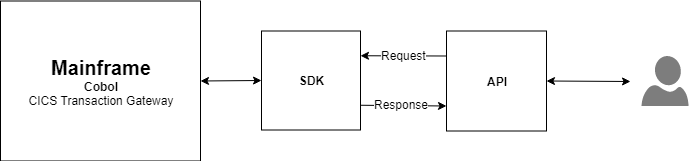
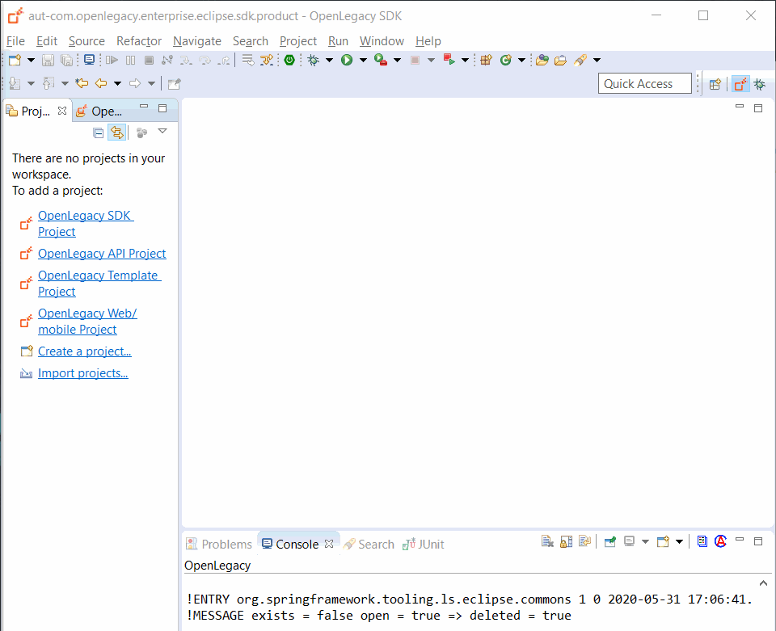
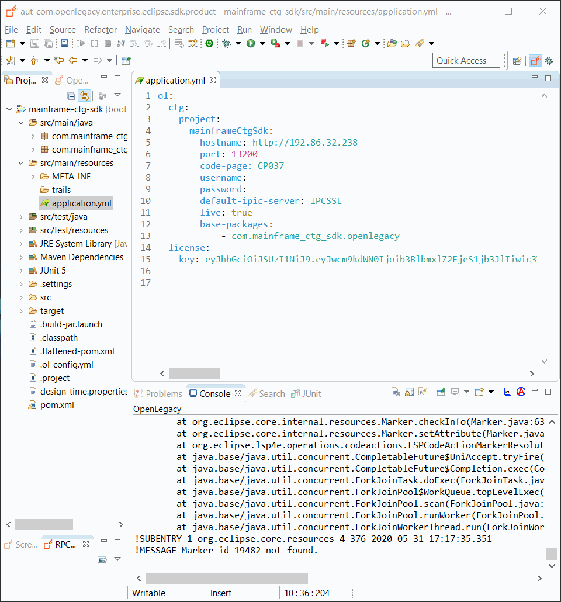
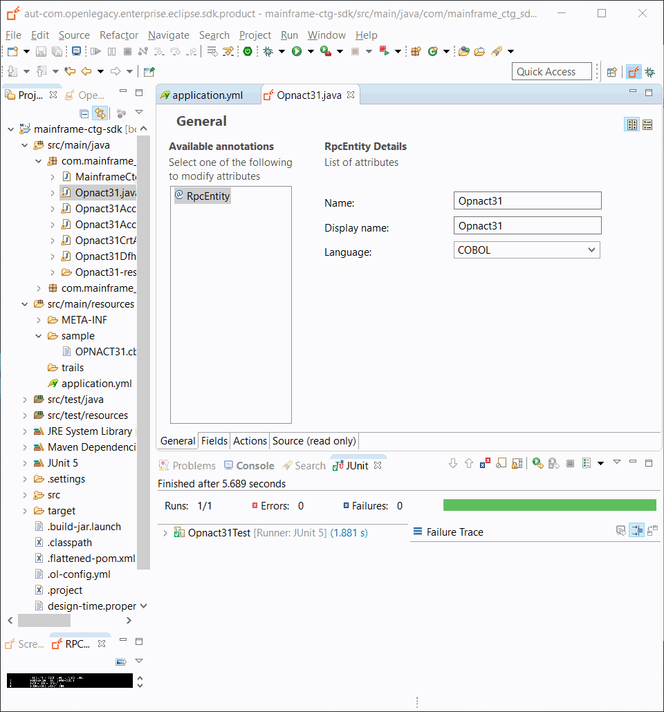
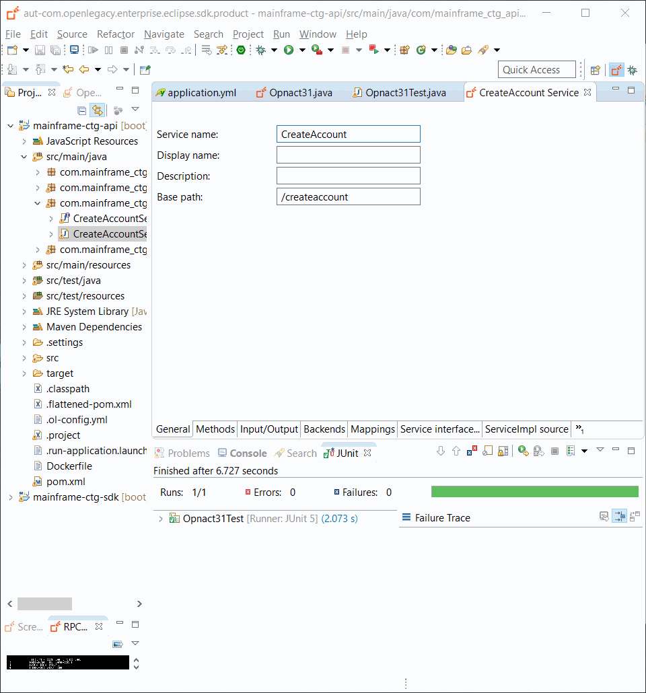

# Mainframe CICS Transaction Gateway (CTG) Demo

## Introduction

The following demo shows how to create an API that creates accounts by forwarding the request to an underlying CICS program using the OpenLegacy adapter.

## Architecture



## Pre-Requirements

- OpenLegacy IDE 4.6.12 (Full installation including JDK and all Maven dependencies).
- Internet Connection

## Demo Definition

- Create a new SDK Project.
- Generate Java model (Entity) from COBOL source file.
- Develop unit tests on the fly.
- Test the connectivity and data retrieval from the **Mainframe CICS**.
- Test the SDK with JUnit and invoke the response.
- Create, run and test an API Project based on your SDK Project.
  
## Demo Resources

- [OPNACT31.cbl](./assets/resources/OPNACT31.cbl)

## Step 1 – Create a New SDK Project

> First, we will create a new SDK project using the OpenLegacy IDE.
The purpose of the SDK project is to allow easy access to legacy backends, using standard and easy to use Java code.

1. Open the New Project Wizard:
   - File → New → OpenLegacy SDK Project
2. Define the **Project Name** as `mainframe-ctg-sdk`
3. Click at the **Default Package** field, to automatically fill it up.
4. Select **Mainframe CICS TG** as the backend and click **Next**
5. Set the connection details to the backend based on following parameters:
    - **CICS Base URL:** `http://192.86.32.238`
    - **Host Port:** `13200`
    - **Code Page:** `CP037`
6. Click **Finish**
7. Go to `src/main/resourse/application.yml` and define the  `default-ipic-server` as `IPCSSL`

   ```yaml
      hostname: mainframe.openlegacy.com
      port: 13200
      code-page: CP037
      default-ipic-server: IPCSSL
   ```



## Step 2 – Generate Java Model (Entity) from the COBOL Source

1. Create a sample folder at `src/main/resources`
2. Copy the following resource to your samples folder at `src/main/resources/sample`:
    - [OPNACT31.cbl](./assets/resources/OPNACT31.cbl)
3. **Right-click** on the `OPNACT31.cbl` file → OpenLegacy → Generate Model
4. **Execution Path**: `OPNACT31`
5. **Entity Name**: `Opnact31`
6. Check **Generate JUnit Test checkbox**
7. Click **OK**



## Step 3 – Create a JUnit Test

> OpenLegacy enables test-driven development by auto-generating test suites for each backend program (entity).
We can extend this test suite with additional unit tests to validate our connectivity to the backend.

1. **Go to** `src/test/java/tests/Opnact31Test.java` 
2. **Modify** the class as the following:
   - **Add** inside the class: 
   
     ```java
	    @Autowired
	    RpcSession rpcSession;
     ```
     
   - **Delete** test functions `opnact31TestUseCaseTest_1` and `opnact31TestUseCaseTest_2`
   - **Add** test function: 
   
     ```java
     	@Test
     	public void testAccountOut() throws Exception {
     		Opnact31 opnact31 = new Opnact31();
     		Opnact31Dfhcommarea dfhcommarea = new Opnact31Dfhcommarea();
     		Opnact31CrtAccountIn crtAccIn = new Opnact31CrtAccountIn();
     		crtAccIn.setActiCustomerId("204693875");
     		crtAccIn.setActiCustomerName("Ori Shalom");
     		crtAccIn.setActiTypcd("P");
     		crtAccIn.setActiSubTypcd("BC");
     		crtAccIn.setActiCntryCd("IL");
     		crtAccIn.setActiBnkId("0012");
     		crtAccIn.setActiBrnchId(89);
     		crtAccIn.setActiInitialDeposit(9385828562.78);
     		crtAccIn.setActiCurrency("USD");
     		dfhcommarea.setCrtAccountIn(crtAccIn);
     		opnact31.setDfhcommarea(dfhcommarea);
     		opnact31 = rpcSession.doAction(RpcActions.execute(), opnact31);
     		Opnact31AccountDetails opnact31AccountDetails = opnact31.getDfhcommarea().getAccountOut().getAccountDetails();
     		assertNotNull(opnact31AccountDetails);
     		assertEquals(9, opnact31AccountDetails.getActoCustomerId().length());
     		assertTrue(opnact31AccountDetails.getActoIban().length() > 0);
     
     	}
     ```
     
> **_NOTE:_** Press `Ctrl + Shift + O` to automatically organize the imports and
> add missing classes.  
> Add Assert imports manually or add the following:  

```
import static org.junit.Assert.assertEquals;
import static org.junit.Assert.assertNotNull;
import static org.junit.Assert.assertTrue;
```

3. Run the JUnit by right-clicking on `testAccountOut` → Run As → JUnit Test.
4. Make sure JUnit passed successfully




## Step 4 – Create APIs from SDK

1. Open the New Project Wizard:
   - File → New → OpenLegacy API Project
2. Define the **Project name** as `mainframe-ctg-api`.
3. Click in the **Default Package** field, to automatically populate it.
4. Press Next and add the SDK project that was created in **Step 1**  as the reference project.
5. **Right-click** on `mainframe-ctg-api` project → OpenLegacy → Generate API from SDK
    - Name the service `CreateAccount`
    - Go to mainframe-ctg-sdk -> Opnact31 and move `dfhcommarea` right as **input**.
    - Go to mainframe-ctg-sdk -> Opnact31 and move `dfhcommarea` right as **output**.
    - **Click OK**


## Step 5 - Run and Test your API

1. **Right-Click** on `mainframe-ctg-api` project → OpenLegacy → Run Application
2. Open the browser on http://localhost:8080/swagger
3. Authorize through **Oauth2**
   - **Client Id:** `client_id`
   - **Client Secret:** `client_secret`
4.  **Click** on the API we created → Try it out

    - Set createAccountIn example value to:
    
        ```
        {
          "dfhcommarea" : {
            "crtAccountIn" : {
              "actiCustomerId" : "204693875",
              "actiCustomerName" : "Ori Shalom",
              "actiTypcd" : "P",
              "actiSubTypcd" : "BC",
              "actiCntryCd" : "IL",
              "actiBnkId" : "0012",
              "actiBrnchId" : 89,
              "actiInitialDeposit" : "9385828562.78",
              "actiCurrency" : "USD"
            }
          }
        }
        ```
      
    - Click Execute
    - You should see a successful response returned directly from the mainframe CICS program `OPNACT31`!

        ```json
        {
          "dfhcommarea": {
            "crtAccountIn": {
              "actiCustomerId": "204693875",
              "actiCustomerName": "Ori Shalom",
              "actiTypcd": "P",
              "actiSubTypcd": "BC",
              "actiCntryCd": "IL",
              "actiBnkId": "0012",
              "actiBrnchId": 89,
              "actiInitialDeposit": 9385828562.78,
              "actiCurrency": "USD"
            },
            "accountOut": {
              "accountDetails": {
                "actoIban": "IL2I001200008I25335900030",
                "actoAccountId": "25335900030",
                "actoCntryCd": "IL",
                "actoBnkId": "0012",
                "actoBrnchId": 89,
                "actoCustomerId": "204693875",
                "actoCustomerName": "Ori Shalom",
                "actoTypcd": "P",
                "actoTypeName": "Personal",
                "actoSubTypcd": "BC",
                "actoTypeDescription": "Basic Checking Account",
                "actoBalance": 9385828562.78,
                "actoCurrency": "USD",
                "actoCrtDt": "20200527",
                "actoUpdtDt": "20200527",
                "actoLocked": "N"
              },
              "rtcd": 0,
              "rtMsg": null
            }
          }
        }
        ```  
 


# Summary

In this demo we  presented an end to end integration with Mainframe CICS using Openlegacy IDE in just a couple of minutes.
We started from a COBOL source of a program we wanted to expose and automatically generated an Java SDK that enables calling
the underlying program. We then created a REST API using the Mainframe CICS CTG SDK.
We used the IDE to better model and design the API and showed how it works with a standard Swagger page.
