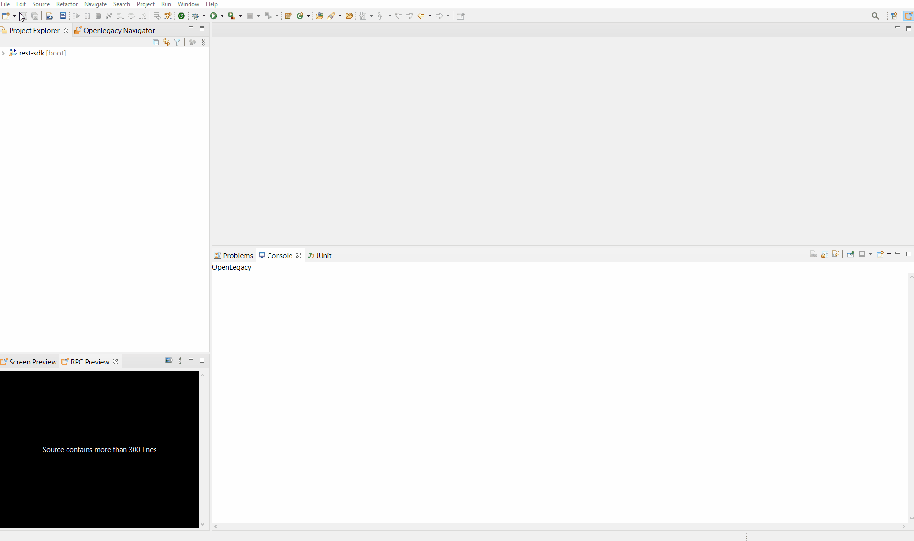
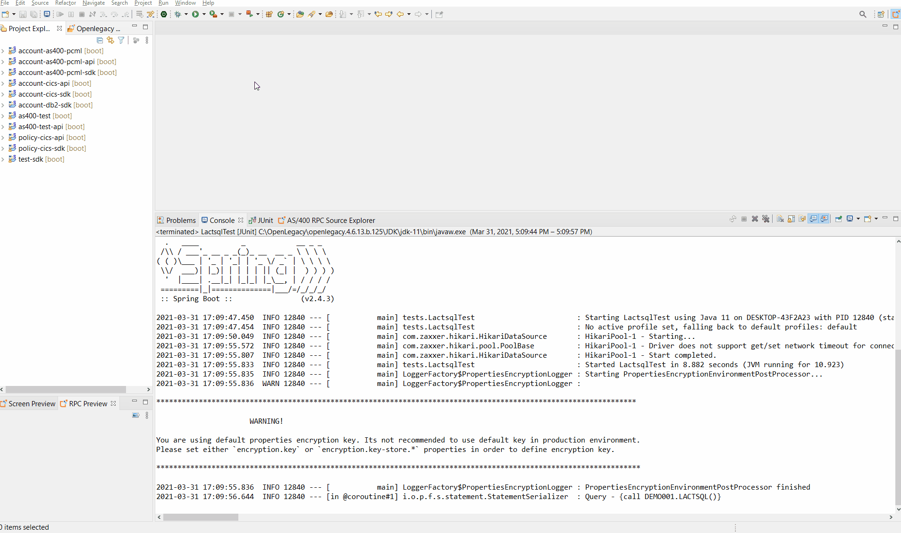
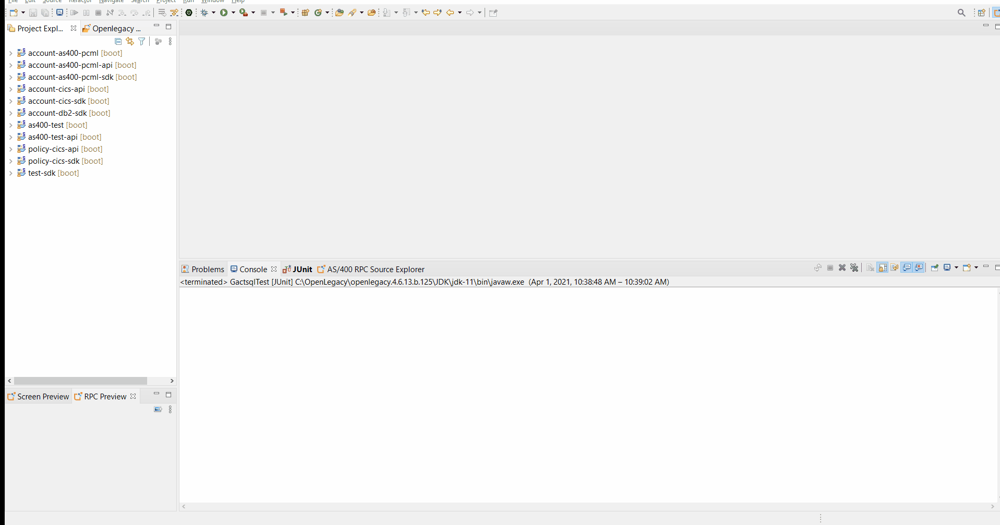
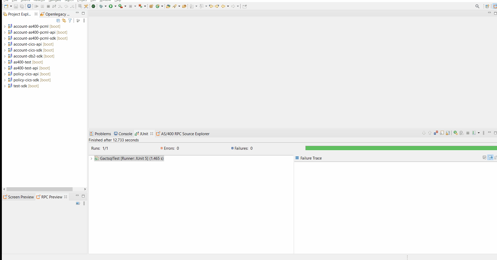
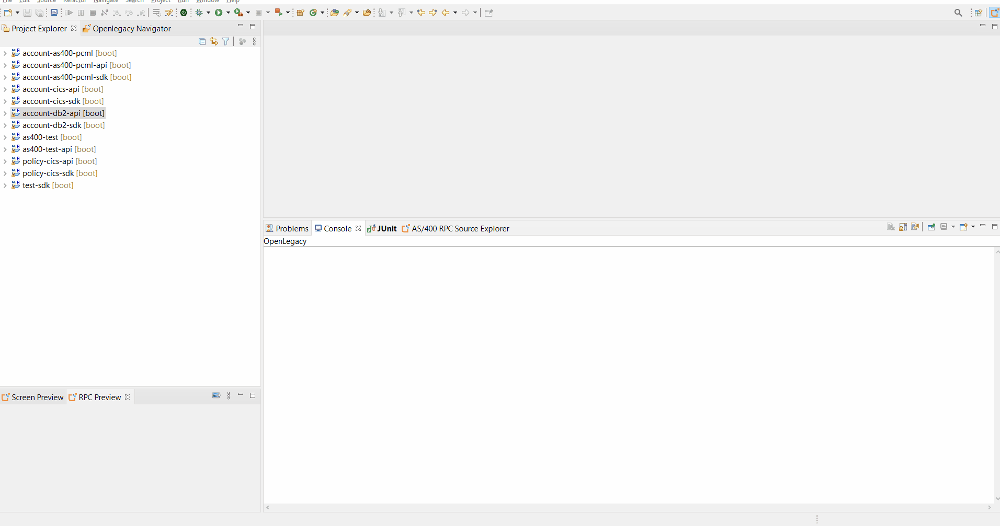

# Expose DB2 Stored Procedure as a REST API

## Introduction

This demo shows generation of Java models from **DB2 Z/OS Stored Procedure** using the OpenLegacy IDE's built in **DB2 Z/OS Procedure Fetcher**, and how to expose it as a **REST API**.

## Pre-Requirements

- OpenLegacy IDE 4.6.12 (Full installation including JDK and all Maven dependencies)
- Internet Connection
- DB2 driver.
- DB2 licence file.

> **_NOTE:_**  When preparing for a DB2 project, DB2 driver and license should be provided by the client. For this demo, please contact support@openlegacy.com to get the files.

## Demo Definition

- Creation of a new SDK Project.
- Import **DB2 Procedure** using **DB2 Procedure Fetcher**.
- Develop and run unit tests on the fly.
- Test the connectivity and data retrieval from the **DB2**.
- Creation of an API Project on top of your SDK Project.

## Step 0 - Set Driver Classpath

- Follow these steps to set the driver and license only if this your first time creating an DB2 SDK project.

1. Open the New Project Wizard:
   - File → New → OpenLegacy SDK Project
2. Define the **Project Name**.
3. Click at the **Default Package** field, to automatically fill it up.
4. Select **Stored Procedures** as the backend and click **Next**.
5. From the **drop-down menu** , choose **DB2/ZOS**.
6. Drop down with pop will appear in order to set driver classpath and license, click **Yes**
7. Set the path to driver jar.
8. Set the path to license file.
9. Restart the IDE.

## Step 1 – Create a New SDK Project

> First, we will create a new SDK project using the OpenLegacy IDE.
The purpose of the SDK project is to allow easy access to legacy backends, using standard and easy to use Java code.

1. Open the New Project Wizard:
   - File → New → OpenLegacy SDK Project
2. Define the **Project Name** as `account-db2-sdk`.
3. Click at the **Default Package** field, to automatically populate it.
4. Select **Stored Procedures** as the backend and click **Next**.
5. From the **Database Type** drop-down menu, choose **DB2 Z/OS**.
6. Enter the following database credentials:
   - **Database URL:** `jdbc:db2://mainframe.openlegacy.com:5035/DALLASB`
   - **Database Username:** `DEMO001`
   - **Database Password:** `LEGACY`
7. Click **Finish**.

## Step 2 – Generate Java Model (Entity) from Stored Procedure

> Now, we will create Java models out of the Stored Procedure we wish to expose.

### Reset Account

1. Right click on the project → OpenLegacy → Import DB2 Stored Procedure
2. Click on **Fetch metadata** and wait until our fetcher returns the list of stored procedures that exist and are viewable for the user in the DB2 Server.
3. From the drop-down of **Database schema** choose **DEMO001**
4. From the drop-down of **Stored procedure** choose **RACTSQL**
5. Check **Generate JUnit Test checkbox**.
6. Click **OK**.

### List Account

1. Right click on the project → OpenLegacy → Import DB2 Stored Procedure
2. Click on **Fetch metadata** and wait until our fetcher returns the list of stored procedures that exist and are viewable for the user in the DB2 Server.
3. From the drop-down of **Database schema** choose **DEMO001**
4. From the drop-down of **Stored procedure** choose **LACTSQL**
5. In the **Result set fetch mode** select **Advanced** and type **CALL DEMO001.LACTSQL**
6. Check **Generate JUnit Test checkbox**.
7. Click **OK**.

### Open Account

1. Right click on the project → OpenLegacy → Import DB2 Stored Procedure
2. Click on **Fetch metadata** and wait until our fetcher returns the list of stored procedures that exist and are viewable for the user in the DB2 Server.
3. From the drop-down of **Database schema** choose **DEMO001**
4. From the drop-down of **Stored procedure** choose **OACTSQL**
5. Check **Generate JUnit Test checkbox**.
6. Click **OK**.

### Get Account

1. Right click on the project → OpenLegacy → Import DB2 Stored Procedure
2. Click on **Fetch metadata** and wait until our fetcher returns the list of stored procedures that exist and are viewable for the user in the DB2 Server.
3. From the drop-down of **Database schema** choose **DEMO001**
4. From the drop-down of **Stored procedure** choose **GACTSQL**
5. In the **Result set fetch mode** select **Advanced** and type **CALL DEMO001.GACTSQL('68841327752')**
5. Check **Generate JUnit Test checkbox**.
6. Click **OK**.

### Update Account

1. Right click on the project → OpenLegacy → Import DB2 Stored Procedure
2. Click on **Fetch metadata** and wait until our fetcher returns the list of stored procedures that exist and are viewable for the user in the DB2 Server.
3. From the drop-down of **Database schema** choose **DEMO001**
4. From the drop-down of **Stored procedure** choose **UACTSQL**
5. Check **Generate JUnit Test checkbox**.
6. Click **OK**.

### Delete Account

1. Right click on the project → OpenLegacy → Import DB2 Stored Procedure
2. Click on **Fetch metadata** and wait until our fetcher returns the list of stored procedures that exist and are viewable for the user in the DB2 Server.
3. From the drop-down of **Database schema** choose **DEMO001**
4. From the drop-down of **Stored procedure** choose **DACTSQL**
5. Check **Generate JUnit Test checkbox**.
6. Click **OK**.

## Step 3 – Create a JUnit Test

> OpenLegacy enables test-driven development by auto-generating test suites for each backend program (entities).
We can extend this test suite with additional unit tests to validate our connectivity to the backend.

### RACTSQL

1. Go to `/src/test/resources/mock/RactsqlTest/test_ractsqlTest_usecase_1.input.json` and replace the JSON with:
- [RACTSQL json Input](./assets/mock/RactsqlTest/test_ractsqlTest_usecase_1.input.json)
2. Go to `/src/test/resources/mock/RactsqlTest/test_ractsqlTest_usecase_1.output.json` and repace it with the expected output:
- [RACTSQL json Output](./assets/mock/RactsqlTest/test_ractsqlTest_usecase_1.output.json)
3. Go to `src/test/java/tests/RactsqlTest.java` and comment the second test. 
4. Right click on `RactsqlTest.java` -> run as JUnit test.   

### LACTSQL

1. Go to `/src/test/resources/mock/LactsqlTest/test_lactsqlTest_usecase_1.input.json` and replace the JSON with:
- [LACTSQL json Input](./assets/mock/LactsqlTest/test_lactsqlTest_usecase_1.input.json)
2. Go to `/src/test/resources/mock/LactsqlTest/test_lactsqlTest_usecase_1.output.json` and repace it with the expected output:
- [LACTSQL json Output](./assets/mock/LactsqlTest/test_lactsqlTest_usecase_1.output.json)
3. Go to `src/test/java/tests/LactsqlTest.java` and comment the second test. 
4. Right click on `LactsqlTest.java` -> run as JUnit test.   

### OACTSQL

1. Go to `/src/test/resources/mock/OactsqlTest/test_oactsqlTest_usecase_1.input.json` and replace the JSON with:
- [OACTSQL json Input](./assets/mock/OactsqlTest/test_oactsqlTest_usecase_1.input.json)
2. Go to `/src/test/resources/mock/OactsqlTest/test_oactsqlTest_usecase_1.output.json` and repace it with the expected output:
- [OACTSQL json Output](./assets/mock/OactsqlTest/test_oactsqlTest_usecase_1.output.json)
3. Go to `src/test/java/tests/OactsqlTest.java` and comment the second test. 
4. Right click on `OactsqlTest.java` -> run as JUnit test.   

### GACTSQL

1. Go to `/src/test/resources/mock/GactsqlTest/test_gactsqlTest_usecase_1.input.json` and replace the JSON with:
- [GACTSQL json Input](./assets/mock/GactsqlTest/test_gactsqlTest_usecase_1.input.json)
2. Go to `/src/test/resources/mock/GactsqlTest/test_gactsqlTest_usecase_1.output.json` and repace it with the expected output:
- [GACTSQL json Output](./assets/mock/GactsqlTest/test_gactsqlTest_usecase_1.output.json)
3. Go to `src/test/java/tests/GactsqlTest.java` and comment the second test. 
4. Right click on `GactsqlTest.java` -> run as JUnit test.   

### UACTSQL

1. Go to `/src/test/resources/mock/UactsqlTest/test_uactsqlTest_usecase_1.input.json` and replace the JSON with:
- [UACTSQL json Input](./assets/mock/UactsqlTest/test_uactsqlTest_usecase_1.input.json)
2. Go to `/src/test/resources/mock/UactsqlTest/test_uactsqlTest_usecase_1.output.json` and repace it with the expected output:
- [UACTSQL json Output](./assets/mock/UactsqlTest/test_uactsqlTest_usecase_1.output.json)
3. Go to `src/test/java/tests/UactsqlTest.java` and comment the second test. 
4. Right click on `UactsqlTest.java` -> run as JUnit test.   

### DACTSQL

1. Go to `/src/test/resources/mock/DactsqlTest/test_dactsqlTest_usecase_1.input.json` and replace the JSON with:
- [DACTSQL json Input](./assets/mock/DactsqlTest/test_dactsqlTest_usecase_1.input.json)
2. Go to `/src/test/resources/mock/DactsqlTest/test_dactsqlTest_usecase_1.output.json` and repace it with the expected output:
- [DACTSQL json Output](./assets/mock/DactsqlTest/test_dactsqlTest_usecase_1.output.json)
3. Go to `src/test/java/tests/DactsqlTest.java` and comment the second test. 
4. Right click on `DactsqlTest.java` -> run as JUnit test.   

If you followed these steps, the test should pass successfully. 

## Step 4 – Create APIs from SDK

1. Open the New Project Wizard:
   - File → New → OpenLegacy API Project
2. Define the **Project name** as `account-db2-api`.
3. Click at the **Default Package** field, to automatically populate it.
4. Press Next and add the SDK project that was created in **Step 1**  as the reference project.
5. Create services from the SDK's entities.

    ### Reset account Service

    **Right-Click** on the **account-db2-api** project → OpenLegacy → Generate API from SDK
    - Name the service `Resetaccount`
    - Select from the `Ractsql` model as input 
    - Select from the `Ractsql` model as output
    - **Click OK**

    ### List Account Service

    **Right-Click** on the **account-db2-api** project → OpenLegacy → Generate API from SDK
    - Name the service `ListAccount`
    - Leave the input empty
    - Select from the `Lactsql` model the `resultSet` as output
    - **Click OK**

    ### Open Account Service

    **Right-Click** on the **account-db2-api** project → OpenLegacy → Generate API from SDK
    - Name the service `OpenAccount`
    - Select from the `Oactsql` model and select all the fields as input
    - Select from the `Oactsql` model and select all the fields as output
    - **Click OK**

    ### Get Account Service

    **Right-Click** on the **account-db2-api** project → OpenLegacy → Generate API from SDK
    - Name the service `GetAccount`
    - Select from the `Gactsql` model the `accountId` as input
    - Select from the `Gactsql` model the `resultSet` as output
    - **Click OK**

    ### Update Account Service

    **Right-Click** on the **account-db2-api** project → OpenLegacy → Generate API from SDK
    - Name the service `UpdateAccount`
    - Select from the `Uactsql` model and select all the fields as input
    - Select from the `Uactsql` model and select all the fields as output
    - **Click OK**

    ### Delete Account Service

    **Right-Click** on the **account-db2-api** project → OpenLegacy → Generate API from SDK
    - Name the service `DeleteAccount`
    - Select from the `Uactsql` model the `accountId` as input
    - Leave the output empty
    - **Click OK**

## Step 5 - Run and Test your API

1. **Right-Click** on the **account API** project → OpenLegacy → Run Application
2. Open the browser on http://localhost:8080/swagger
3. Authorize through **Oauth2**
   - **Client ID:** `client_id`
   - **Client Secret:** `client_secret`
4.  **Click** on the API we created → Try it out

    ### ResetAccount
    - Set data as input from - [Ractsql json Input](./assets/mock/RactsqlTest/test_ractsqlTest_usecase_1.input.json)
    - You should see successful respond returned directly from DB2 program.
    ### ListAccount
    - Set data as input from - [Lactsql json Input](./assets/mock/LactsqlTest/test_lactsqlTest_usecase_1.input.json)
    - You should see successful respond returned directly from DB2 program.
    
    ### OpenAccount
    - Set data as input from - [Oactsql json Input](./assets/mock/OactsqlTest/test_oactsqlTest_usecase_1.input.json)
    - You should see successful respond returned directly from DB2 program.
    
    ### GetAccount
    - Set data as input from - [Gactsql json Input](./assets/mock/GactsqlTest/test_gactsqlTest_usecase_1.input.json)
    - You should see successful respond returned directly from DB2 program.
    
    ### UpdateAccount
    - Set data as input from - [Uactsql json Input](./assets/mock/UactsqlTest/test_uactsqlTest_usecase_1.input.json)
    - You should see successful respond returned directly from DB2 program.
    
    ### DeleteAccount
    - Set data as input from - [Dactsql json Input](./assets/mock/DactsqlTest/test_dactsqlTest_usecase_1.input.json)
    - You should see successful respond returned directly from DB2 program.

    

## Summary

In this demo we have presented an end to end integration with  **DB2 Z/OS** using the OpenLegacy IDE within just a few minutes. We began by fetching procedure metadata from a DB2 Server, then, based on the metadata, we automatically generated the Java SDK that enables calling the Stored Procedure. We then demonstrated the creation of a REST API utilizing the DB2 Stored Procedure SDK.
We used the IDE to better model and design the API and showed how it works with a standard Swagger page.
