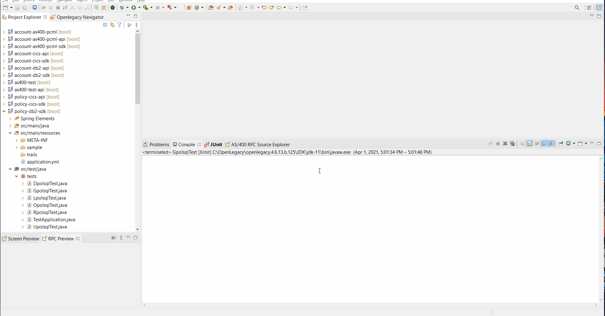

# Expose DB2 Stored Procedure as a REST API

## Introduction

This demo shows generation of Java models from **DB2 Z/OS Stored Procedure** using the OpenLegacy IDE's built in **DB2 Procedure Fetcher**, and how to expose it as a **REST API**.

## Pre-Requirements

- OpenLegacy IDE 4.6.12 (Full installation including JDK and all Maven dependencies)
- Internet Connection
- DB2 driver.
- Db2 licence file.
> **_NOTE:_**  When preparing for a DB2 project, Db2 driver and license should be provided by the client.

## Demo Definition

- Creation of a new SDK Project.
- Import **DB2 Procedure** using **DB2 Procedure Fetcher**.
- Develop and run unit tests on the fly.
- Test the connectivity and data retrieval from the **DB2**.
- Creation of an API Project on top of your SDK Project.

## Step 0 - Set Driver Classpath

- Only if this your first time creating an DB2 SDK project you have to set the driver and licence and follow this step.

1. Open the New Project Wizard:
   - File → New → OpenLegacy SDK Project
2. Define the **Project Name**.
3. Click at the **Default Package** field, to automatically fill it up.
4. Select **Stored Procedures** as the backend and click **Next**.
5. From the **drop-down menu** , choose **DB2/ZOS**.
6. Drop down with pop will appear in order to set driver clathpath and license, click **Yes**
7. Set the path to driver jar.
8. Set the path to licence file.
9. Restart the ide

## Step 1 – Create a New SDK Project

> First, we will create a new SDK project using the OpenLegacy IDE.
The purpose of the SDK project is to allow easy access to legacy backends, using standard and easy to use Java code.

1. Open the New Project Wizard:
   - File → New → OpenLegacy SDK Project
2. Define the **Project Name** as `policy-db2-sdk`.
3. Click at the **Default Package** field, to automatically fill it up.
4. Select **Stored Procedures** as the backend and click **Next**.
5. From the **Database Type** drop-down menu, choose **DB2 Z/OS**.
6. Enter the following database credentials:
   - **Database URL:** `jdbc:db2://mainframe.openlegacy.com:5035/DALLASB`
   - **Database Username:** `DEMO001`
   - **Database Password:** `LEGACY`
7. Click **Finish**.

## Step 2 – Generate Java Model (Entity) from Stored Procedure

> Now, we will create Java models out of our Stored Procedure we wish to expose.

### Reset Policy

1. Right click on the project → OpenLegacy → Import DB2 Stored Procedure
2. Click on **Fetch metadata** and wait until our fetcher returns the list of stored procedures that exist and viewable for the user in the DB2 Server.
3. From the drop-down of **Database schema** choose **DEMO001**
4. From the drop-down of **Stored procedure** choose **RPOLSQL**
5. Check **Generate JUnit Test checkbox**.
6. Click **OK**.

### List Policy

1. Right click on the project → OpenLegacy → Import DB2 Stored Procedure
2. Click on **Fetch metadata** and wait until our fetcher returns the list of stored procedures that exist and viewable for the user in the DB2 Server.
3. From the drop-down of **Database schema** choose **DEMO001**
4. From the drop-down of **Stored procedure** choose **LPOLSQL**
5. In the **Result set fetch mode** select **Advnced** and type **CALL DEMO001.LPOLSQL**
6. Check **Generate JUnit Test checkbox**.
7. Click **OK**.

### Open Policy

1. Right click on the project → OpenLegacy → Import DB2 Stored Procedure
2. Click on **Fetch metadata** and wait until our fetcher returns the list of stored procedures that exist and viewable for the user in the DB2 Server.
3. From the drop-down of **Database schema** choose **DEMO001**
4. From the drop-down of **Stored procedure** choose **OPOLSQL**
5. Check **Generate JUnit Test checkbox**.
6. Click **OK**.

### Get Policy

1. Right click on the project → OpenLegacy → Import DB2 Stored Procedure
2. Click on **Fetch metadata** and wait until our fetcher returns the list of stored procedures that exist and viewable for the user in the DB2 Server.
3. From the drop-down of **Database schema** choose **DEMO001**
4. From the drop-down of **Stored procedure** choose **GPOLSQL**
5. In the **Result set fetch mode** select **Advnced** and type **CALL DEMO001.GPOLSQL('68841327752')**
5. Check **Generate JUnit Test checkbox**.
6. Click **OK**.

### Update Policy

1. Right click on the project → OpenLegacy → Import DB2 Stored Procedure
2. Click on **Fetch metadata** and wait until our fetcher returns the list of stored procedures that exist and viewable for the user in the DB2 Server.
3. From the drop-down of **Database schema** choose **DEMO001**
4. From the drop-down of **Stored procedure** choose **UPOLSQL**
5. Check **Generate JUnit Test checkbox**.
6. Click **OK**.

### Delete Policy

1. Right click on the project → OpenLegacy → Import DB2 Stored Procedure
2. Click on **Fetch metadata** and wait until our fetcher returns the list of stored procedures that exist and viewable for the user in the DB2 Server.
3. From the drop-down of **Database schema** choose **DEMO001**
4. From the drop-down of **Stored procedure** choose **DPOLSQL**
5. Check **Generate JUnit Test checkbox**.
6. Click **OK**.

## Step 3 – Create a JUnit Test

> OpenLegacy enables test-driven development by auto-generating test suites for each backend program (entities).
We can extend this test suite with additional unit tests to validate our connectivity to the backend.

### RPOLSQL

1. Go to `/src/test/resources/mock/RpolsqlTest/test_rpolsqlTest_usecase_1.input.json` and replace the JSON with:
- [RPOLSQL json Input](./assets/mock/RpolsqlTest/test_rpolsqlTest_usecase_1.input.json)
2. Go to `/src/test/resources/mock/RpolsqlTest/test_rpolsqlTest_usecase_1.output.json` and repace it with the expected output:
- [RPOLSQL json Output](./assets/mock/RpolsqlTest/test_rpolsqlTest_usecase_1.output.json)
3. Go to `src/test/java/tests/RpolsqlTest.java` and comment the second test. 
4. Right click on `RpolsqlTest.java` -> run as JUnit test.   

### LPOLSQL

1. Go to `/src/test/resources/mock/LpolsqlTest/test_lpolsqlTest_usecase_1.input.json` and replace the JSON with:
- [LPOLSQL json Input](./assets/mock/LpolsqlTest/test_lpolsqlTest_usecase_1.input.json)
2. Go to `/src/test/resources/mock/LpolsqlTest/test_lpolsqlTest_usecase_1.output.json` and repace it with the expected output:
- [LPOLSQL json Output](./assets/mock/LpolsqlTest/test_lpolsqlTest_usecase_1.output.json)
3. Go to `src/test/java/tests/LpolsqlTest.java` and comment the second test. 
4. Right click on `LpolsqlTest.java` -> run as JUnit test.  

### OPOLSQL

1. Go to `/src/test/resources/mock/OpolsqlTest/test_opolsqlTest_usecase_1.input.json` and replace the JSON with:
- [OPOLSQL json Input](./assets/mock/OpolsqlTest/test_opolsqlTest_usecase_1.input.json)
2. Go to `/src/test/resources/mock/OpolsqlTest/test_opolsqlTest_usecase_1.output.json` and repace it with the expected output:
- [OPOLSQL json Output](./assets/mock/OpolsqlTest/test_opolsqlTest_usecase_1.output.json)
3. Go to `src/test/java/tests/OpolsqlTest.java` and comment the second test. 
4. Right click on `OpolsqlTest.java` -> run as JUnit test.  

### GPOLSQL

1. Go to `/src/test/resources/mock/GpolsqlTest/test_gpolsqlTest_usecase_1.input.json` and replace the JSON with:
- [GPOLSQL json Input](./assets/mock/GpolsqlTest/test_gpolsqlTest_usecase_1.output.json)
2. Go to `/src/test/resources/mock/GpolsqlTest/test_gpolsqlTest_usecase_1.output.json` and repace it with the expected output:
- [GPOLSQL json Output](./assets/mock/GpolsqlTest/test_gpolsqlTest_usecase_1.output.json)
3. Go to `src/test/java/tests/GpolsqlTest.java` and comment the second test. 
4. Right click on `GpolsqlTest.java` -> run as JUnit test.  

### UPOLSQL

1. Go to `/src/test/resources/mock/UpolsqlTest/test_upolsqlTest_usecase_1.input.json` and replace the JSON with:
- [UPOLSQL json Input](./assets/mock/UpolsqlTest/test_upolsqlTest_usecase_1.input.json)
2. Go to `/src/test/resources/mock/UpolsqlTest/test_upolsqlTest_usecase_1.output.json` and repace it with the expected output:
- [UPOLSQL json Output](./assets/mock/UpolsqlTest/test_upolsqlTest_usecase_1.output.json)
3. Go to `src/test/java/tests/UpolsqlTest.java` and comment the second test. 
4. Right click on `UpolsqlTest.java` -> run as JUnit test.  

### DPOLSQL

1. Go to `/src/test/resources/mock/DpolsqlTest/test_dpolsqlTest_usecase_1.input.json` and replace the JSON with:
- [DPOLSQL json Input](./assets/mock/DpolsqlTest/test_dpolsqlTest_usecase_1.input.json)
2. Go to `/src/test/resources/mock/DpolsqlTest/test_dpolsqlTest_usecase_1.output.json` and repace it with the expected output:
- [RPOLSQL json Output](./assets/mock/DpolsqlTest/test_dpolsqlTest_usecase_1.output.json)
3. Go to `src/test/java/tests/DpolsqlTest.java` and comment the second test. 
4. Right click on `DpolsqlTest.java` -> run as JUnit test.  

If you followed the steps above the test should pass successfully. 

## Step 4 – Create APIs from SDK

1. Open the New Project Wizard:
   - File → New → OpenLegacy API Project
2. Define the **Project name** as `policy-db2-api`.
3. Click at the **Default Package** field, to automatically fill it up.
4. Press Next and add the SDK project that was created in **Step 1**  as the reference project.
5. Create services from the SDK's entities.

    ### Reset policy Service

    **Right-Click** on the **policy-db2-api** project → OpenLegacy → Generate API from SDK
    - Name the service `ResetPolicy`
    - Select from the `Rpolsql` model as input 
    - Select from the `Rpolsql` model as output
    - **Click OK**

    ### List policy Service

    **Right-Click** on the **policy-db2-api** project → OpenLegacy → Generate API from SDK
    - Name the service `ListPolicy`
    - Leave the input empty
    - Select from the `Lpolsql` model the `resultSet` as output
    - **Click OK**

    ### Open policy Service

    **Right-Click** on the **policy-db2-api** project → OpenLegacy → Generate API from SDK
    - Name the service `OpenPolicy`
    - Select from the `Opolsql` model and select all the fields as input
    - Select from the `Opolsql` model and select all the fields as output
    - **Click OK**

    ### Get policy Service

    **Right-Click** on the **policy-db2-api** project → OpenLegacy → Generate API from SDK
    - Name the service `GetPolicy`
    - Select from the `Gpolsql` model the `policyNum` as input
    - Select from the `Gactsql` model the `resultSet` as output
    - **Click OK**

    ### Update policy Service

    **Right-Click** on the **policy-db2-api** project → OpenLegacy → Generate API from SDK
    - Name the service `UpdatePolicy`
    - Select from the `Upolsql` model and select all the fields as input
    - Select from the `Upolsql` model and select all the fields as output
    - **Click OK**

    ### Delete policy Service

    **Right-Click** on the **policy-db2-api** project → OpenLegacy → Generate API from SDK
    - Name the service `DeletePolicy`
    - Select from the `Dpolsql` model the `accountId` as input
    - Leave the output empty
    - **Click OK**

## Step 5 - Run and Test your API

1. **Right-Click** on the **policy API** project → OpenLegacy → Run Application
2. Open the browser on http://localhost:8080/swagger
3. Authorize through **Oauth2**
   - **Client Id:** `client_id`
   - **Client Secret:** `client_secret`
4.  **Click** on the API we've created → Try it out

    ### ResetPolicy
    - Set data as input from - [Rpolsql json Input](./assets/mock/RpolsqlTest/test_rpolsqlTest_usecase_1.input.json)
    - You should see successful respond returned directly from DB2 program.
    ### ListPolicy
    - Set data as input from - [Lpolsql json Input](./assets/mock/LpolsqlTest/test_lpolsqlTest_usecase_1.input.json)
    - You should see successful respond returned directly from DB2 program.
    
    ### OpenPolicy
    - Set data as input from - [Opolsql json Input](./assets/mock/OpolsqlTest/test_opolsqlTest_usecase_1.input.json)
    - You should see successful respond returned directly from DB2 program.
    
    ### GetPolicy
    - Set data as input from - [Gpolsql json Input](./assets/mock/GpolsqlTest/test_gpolsqlTest_usecase_1.input.json)
    - You should see successful respond returned directly from DB2 program.
    
    ### UpdatePolicy
    - Set data as input from - [Upolsql json Input](./assets/mock/UpolsqlTest/test_upolsqlTest_usecase_1.input.json)
    - You should see successful respond returned directly from DB2 program.
    
    ### DeletePolicy
    - Set data as input from - [Dpolsql json Input](./assets/mock/DpolsqlTest/test_dpolsqlTest_usecase_1.input.json)
    - You should see successful respond returned directly from DB2 program.

    

## Summary

In this demo we have presented an end to end integration with the **DB2 Z/OS** using the OpenLegacy IDE within just a couple of minutes. We have started with fetching procedure metadata from a DB2 Server, based on the metadata we automatically generated the Java SDK that enables calling the Stored Procedure, later on we have presented the creation of a REST API utilizing the DB2 Stored Procedure SDK.
We used the IDE to better model and design the API and showed how it works with a standard Swagger page.