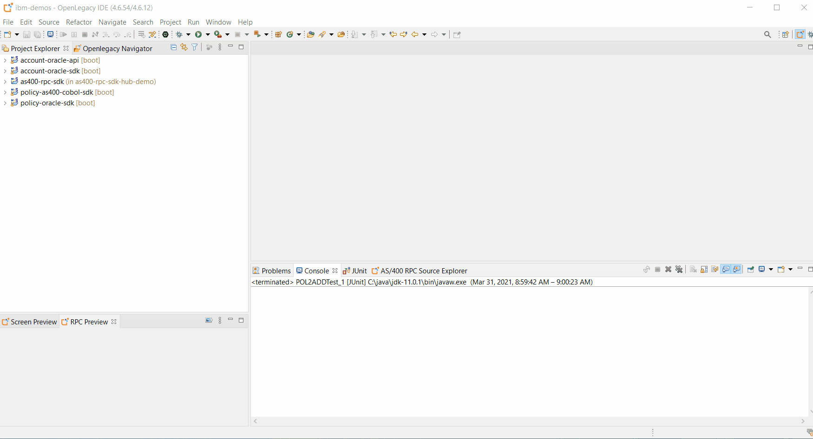
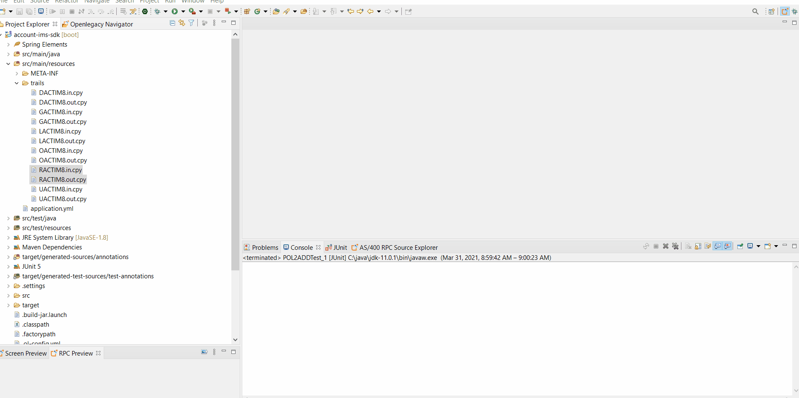
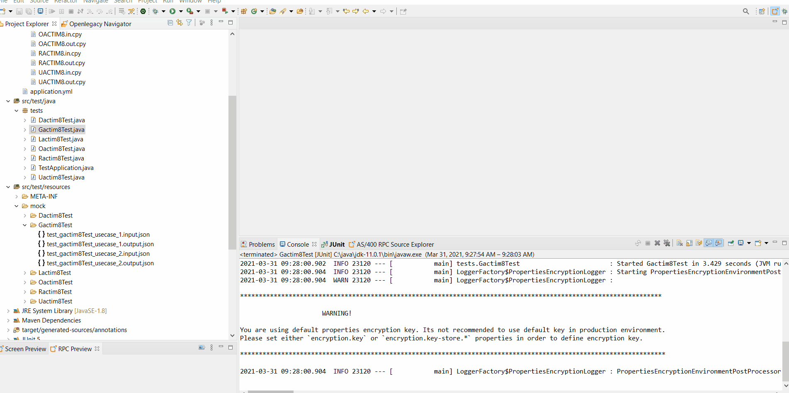
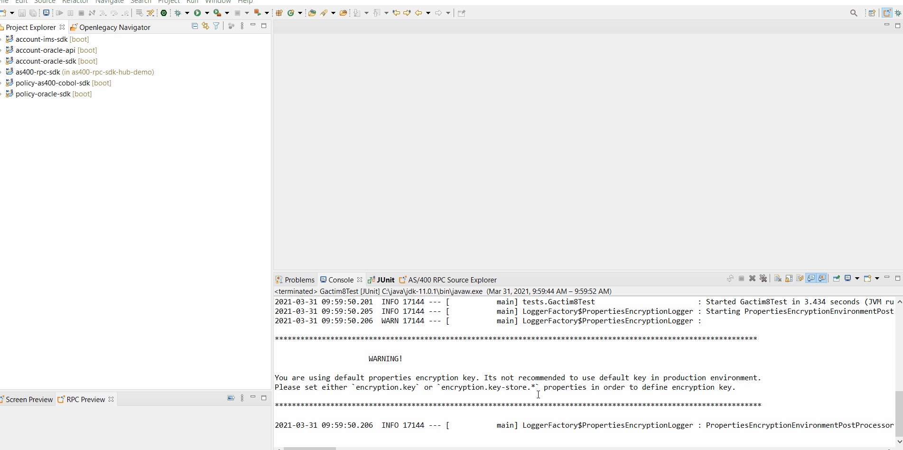
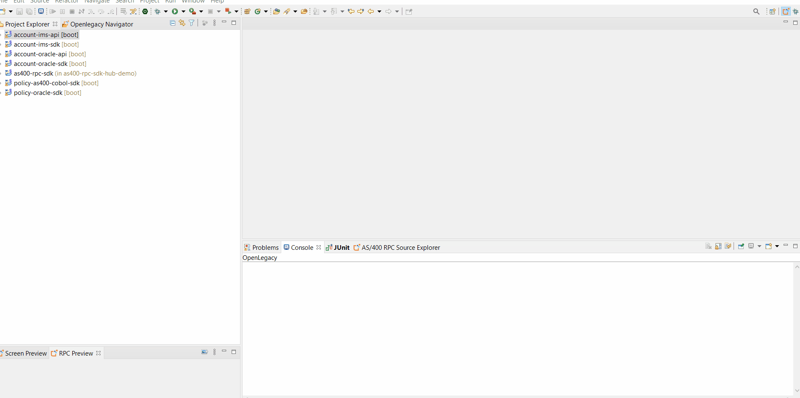

# How To Create Banking Mainframe-IMS REST API

## Introduction

This demo shows generation of Java models from a **copy book** using OpenLegacy IDE's, test connectivity and data retrieval from host and how to expose it as a **REST API**.

## Pre-Requirements

- OpenLegacy IDE 4.6.12 (Full installation including JDK and all Maven dependencies)
- Internet Connection

## Demo Resources
- [DACTIM8.in.cpy](./assets/resources/DACTIM8.in.cpy)
- [DACTIM8.out.cpy](./assets/resources/DACTIM8.out.cpy)
- [GACTIM8.in.cpy](./assets/resources/GACTIM8.in.cpy)
- [GACTIM8.out.cpy](./assets/resources/GACTIM8.out.cpy)
- [LACTIM8.in.cpy](./assets/resources/LACTIM8.in.cpy)
- [LACTIM8.out.cpy](./assets/resources/LACTIM8.out.cpy)
- [RACTIM8.in.cpy](./assets/resources/RACTIM8.in.cpy)
- [RACTIM8.out.cpy](./assets/resources/RACTIM8.out.cpy)
- [UACTIM8.in.cpy](./assets/resources/UACTIM8.in.cpy)
- [UACTIM8.out.cpy](./assets/resources/UACTIM8.out.cpy)
- [OACTIM8.in.cpy](./assets/resources/OACTIM8.in.cpy)
- [OACTIM8.out.cpy](./assets/resources/OACTIM8.out.cpy)

## Demo Definition

- Create a new SDK Project.
- Generate Java model (Entity) from COBOL source file.
- Develop unit tests on the fly.
- Test the connectivity and data retrieval from the **Mainframe host**.
- You will use JUnit tests to test the SDK and invoke the response.
- Creation of an API Project on the top of your SDK Project.

## Step 1 – Create a New SDK Project

> First, we will create a new SDK project using the OpenLegacy IDE.
The purpose of the SDK project is to allow easy access to legacy backends, using standard and easy to use Java code.

1. Open the New Project Wizard:
   - File → New → OpenLegacy SDK Project
2. Define the **Project Name** as `account-ims-sdk`.
3. Click at the **Default Package** field, to automatically fill it up.
4. Select **Mainframe IMS TM** as the backend and click **Next**.
5. Enter the following credentials:
   - **Host Name/IP:** `mainframe.openlegacy.com` 
   - **Host Port:** `9999`
   - **Data Store Name:** `IVP1`
   - **Mark the Racf Enabled and set Racf **User** : `DEMO001`, **Password** : `Legacy`, and **GroupId**: `GROUP1`**
6. Click **Finish**



## Step 2 – Generate Java Model (Entity) from copybook
> Now, we will create Java models out of our copy book file we wish to expose.

> In this example we will use banking CRUD copybooks files that copied to: `src/main/resources/trails/` directory

> In order to generate entity from copybooks, go to `design-time.properties` and set `generateCopyAsEntity` to `true`. 

- **DACTIM8**:
  - Copy `DACTIM8.in.cpy` and `DACTIM8.out.cpy` into `src/main/resources/trails/`.
  - Right-click on `DACTIM8.in.cpy`, the output copybook, entity name and the transaction will be automatically filled. 
  - Check the Junit test checkbooks.
  - Click **OK**. 

- **GACTIM8**:
  - Copy `GACTIM8.in.cpy` and `GACTIM8.out.cpy` into `src/main/resources/trails/`.
  - Right-click on `GACTIM8.in.cpy`, the output copybook, entity name and the transaction will be automatically filled. 
  - Check the Junit test checkbooks.
  - Click **OK**. 

- **LACTIM8**:
  - Copy `LACTIM8.in.cpy` and `LACTIM8.out.cpy` into `src/main/resources/trails/`.
  - Right-click on `LACTIM8.in.cpy`, the output copybook, entity name and the transaction will be automatically filled. 
  - Check the Junit test checkbooks.
  - Click **OK**. 

- **OACTIM8**:
  - Copy `OACTIM8.in.cpy` and `OACTIM8.out.cpy` into `src/main/resources/trails/`.
  - Right-click on `OACTIM8.in.cpy`, the output copybook, entity name and the transaction will be automatically filled. 
  - Check the Junit test checkbooks.
  - Click **OK**. 

- **RACTIM8**:
  - Copy `RACTIM8.in.cpy` and `RACTIM8.out.cpy` into `src/main/resources/trails/`.
  - Right-click on `RACTIM8.in.cpy`, the output copybook, entity name and the transaction will be automatically filled. 
  - Check the Junit test checkbooks.
  - Click **OK**. 

- **UACTIM8**:
  - Copy `UACTIM8.in.cpy` and `UACTIM8.out.cpy` into `src/main/resources/trails/`.
  - Right-click on `UACTIM8.in.cpy`, the output copybook, entity name and the transaction will be automatically filled. 
  - Mark the Junit test checkbooks.
  - Click **OK**. 




## Step 3 – Create the JUnits Test

> OpenLegacy enables test-driven development by auto-generating test suites for each backend program (entities).
We can extend this test suite with additional unit tests to validate our connectivity to the backend.

> _**NOTE**_ the tests of `OACTIM8`, `OACTIM8`, `GACTIM8` return `actoIban` field which change its value after evry account creation. 
In order to reuse the test you can add the following to the test. 

```     
        List<String> ignore = new  ArrayList<>();
        ignore.add("actoIban");
        super.baseTest(oactim8TestInput, oactim8TestOutput,Oactim8.class, ignore);
```


- **RACTIM8**
   - Go to `/account-ims-sdk/src/test/resources/mock/Ractim8Test/test_ractim8Test_usecase_1.input.json` and replace it with the follwoing [reset-accounts-input json](./assets/resources/test_ractim8Test_usecase_1.input.json). 
  -  Go to `/account-ims-sdk/src/test/resources/mock/Ractim8Test/test_ractim8Test_usecase_1.output.json`  and replace it with the following [reset-accounts-output json](./assets/resources/test_ractim8Test_usecase_1.output.json).  
  - Go to `/account-ims-sdk/src/test/java/tests/Ractim8Test.java`, comment the second test.
  - Right-click on the test → Run as JUnit test. 


- **LACTIM8**
  -  Go to `/account-ims-sdk/src/test/resources/mock/Lactim8Test/test_Lactim8Test_usecase_1.output.json`  and replace it with the following [get-all-accounts-output json](./assets/resources/test_Lactim8Test_usecase_1.output.json). 
  - Go to `/account-ims-sdk/src/test/java/tests/Lactim8Test.java`,    comment the second test.
  - Right-click on the test → Run as JUnit test. 

- **OACTIM8**
   - Go to `/account-ims-sdk/src/test/resources/mock/Oactim8Test/test_oactim8Test_usecase_1.input.json` and replace it with the follwoing [open-account-input json](./assets/resources/test_oactim8Test_usecase_1.input.json). 
  -  Go to `/account-ims-sdk/src/test/resources/mock/Oactim8Test/test_oactim8Test_usecase_1.output.json`  and replace it with the following [open-account-output json](./assets/resources/test_oactim8Test_usecase_1.output.json).  
  - Go to `/account-ims-sdk/src/test/java/tests/Oactim8Test.java`, comment the second test.
  - Right-click on the test → Run as JUnit test. 


- **UACTIM8**
   - Go to `/account-ims-sdk/src/test/resources/mock/Uactim8Test/test_uactim8Test_usecase_1.input.json` and replace it with the follwoing [update-account-input json](./assets/resources/test_uactim8Test_usecase_1.input.json). 
  -  Go to `/account-ims-sdk/src/test/resources/mock/Uactim8Test/test_uactim8Test_usecase_1.output.json`  and replace it with the following [update-account-output json](./assets/resources/test_uactim8Test_usecase_1.output.json).  
  - Go to `/account-ims-sdk/src/test/java/tests/Uactim8Test.java`, comment the second test.
  - Right-click on the test → Run as JUnit test. 
  
- **GACTIM8**
   - Go to `/account-ims-sdk/src/test/resources/mock/Gactim8Test/test_gactim8Test_usecase_1.input.json` and replace it with the follwoing [get-account-input json](./assets/resources/test_gactim8Test_usecase_1.input.json). 
  -  Go to `/account-ims-sdk/src/test/resources/mock/Gactim8Test/test_gactim8Test_usecase_1.output.json`  and replace it with the following [get-account-output json](./assets/resources/test_gactim8Test_usecase_1.output.json).  
  - Go to `/account-ims-sdk/src/test/java/tests/Gactim8Test.java`, comment the second test.
  - Right-click on the test → Run as JUnit test. 

- **DACTIM8**
   - Go to `/account-ims-sdk/src/test/resources/mock/Dactim8Test/test_dactim8Test_usecase_1.input.json` and replace it with the follwoing [get-account-input json](./assets/resources/test_dactim8Test_usecase_1.input.json). 
  -  Go to `/account-ims-sdk/src/test/resources/mock/Dactim8Test/test_dactim8Test_usecase_1.output.json`  and replace it with the following [get-account-output json](./assets/resources/test_dactim8Test_usecase_1.output.json).  
  - Go to `/account-ims-sdk/src/test/java/tests/Dactim8Test.java`, comment the second test.
  - Right-click on the test → Run as JUnit test. 





## Step 4 – Create APIs from SDK

1. Open the New Project Wizard:
   - File → New → OpenLegacy API Project.
2. Define the project name as `account-mainframe-ims-api`.
3. Click at the **Default Package** field, to automatically fill it up.
4. Press Next and add the SDK project that was created in **Step 1**  as the reference project.



5. Create services from the SDK's entities. 
- **RACTIM8**
  - **right-click** on the project and navigate to Openlegacy → Generate API from SDK
   - Define the Service name as `ResetAccounts`.
   - Set `RACTIM8` → `ractim8Input` as input.
   - Set `RACTIM8` → `ractim8Output`  as output.
   - Click **OK**.

- **LACTIM8**
  - **right-click** on the project and navigate to Openlegacy → Generate API from SDK
   - Define the Service name as `GetAllAccounts`.
   - Set `LACTIM8` → `lactim8Input` as input.
   - Set `LACTIM8` → `lactim8Output`  as output.
   - Click **OK**.

- **OACTIM8**
  - **right-click** on the project and navigate to Openlegacy → Generate API from SDK
   - Define the Service name as `OpenAccount`.
   - Set `OACTIM8` → `oactim8Input` as input.
   - Set `OACTIM8` → `oactim8Output`  as output.
   - Click **OK**.

- **UACTIM8**
  - **right-click** on the project and navigate to Openlegacy → Generate API from SDK
   - Define the Service name as `UpdateAccount`.
   - Set `UACTIM8` → `uactim8Input` as input.
   - Set `UACTIM8` → `uactim8Output`  as output.
   - Click **OK**.

- **GACTIM8**
  - **right-click** on the project and navigate to Openlegacy → Generate API from SDK
   - Define the Service name as `GetAccount`.
   - Set `GACTIM8` → `gactim8Input` as input.
   - Set `GACTIM8` → `gactim8Output`  as output.
   - Click **OK**.

- **DACTIM8**
  - **right-click** on the project and navigate to Openlegacy → Generate API from SDK
   - Define the Service name as `DeleteAccount`.
   - Set `DACTIM8` → `dactim8Input` as input.
   - Set `DACTIM8` → `dactim8Output`  as output.
   - Click **OK**.




## Step 5 - Run and Test your API

1. **Right-Click** on the API project → OpenLegacy → Run Application
2. Open the browser on http://localhost:8080/swagger
3. Authorize through **Oauth2**
   - **Client Id:** `client_id`
   - **Client Secret:** `client_secret`
4. Test the API
- **Click** on the  `/api​/resetaccount` → Try it out ,  
 use the following JSON as input [reset-accounts-input json](./assets/resources/test_ractim8Test_usecase_1.input.json), and click **Execute**. 

- **Click** on the  `/api/getallaccounts` → Try it out ,  
 use the following JSON as input 
   ```
   {
    "lactim8Input": {
      "onechar": "A"
    }
  }
  ```
   , and click **Execute**. 

- **Click** on the  `/api/openaccount` → Try it out ,  
 use the following JSON as input [open-account-input json](./assets/resources/test_oactim8Test_usecase_1.input.json), and click **Execute**.

- **Click** on the  `/api/updateaccount` → Try it out ,  
 use the following JSON as input [update-account-input json](./assets/resources/test_uactim8Test_usecase_1.input.json), and click **Execute**. 

- **Click** on the  `/api/getaccount` → Try it out ,  
 use the following JSON as input [get-account-input json](./assets/resources/test_gactim8Test_usecase_1.input.json), and click **Execute**. 

- **Click** on the  `/api/deleteaccount` → Try it out ,  
 use the following JSON as input [delete-account-input json](./assets/resources/test_dactim8Test_usecase_1.input.json), and click **Execute**. 


## Summary

In this demo we have presented an end to end integration with **Mainframe IMS** using OpenLegacy IDE within just a couple of minutes. Based on the copy book supllied we have automatically generated Java SDK that enables calling the mainframe IMS, later on we have presented the creation of a REST API utilizing the SDK.
We used the IDE to better model and design the API and showed how it works with a standard Swagger page.
