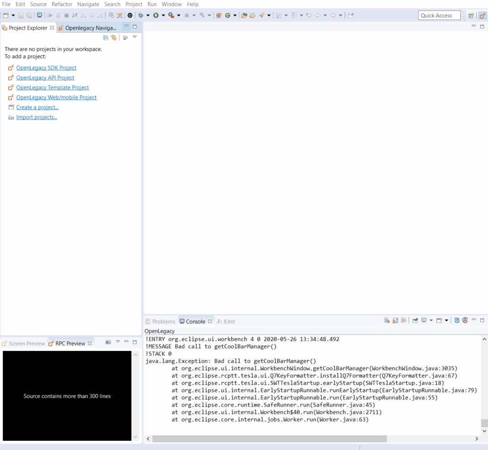
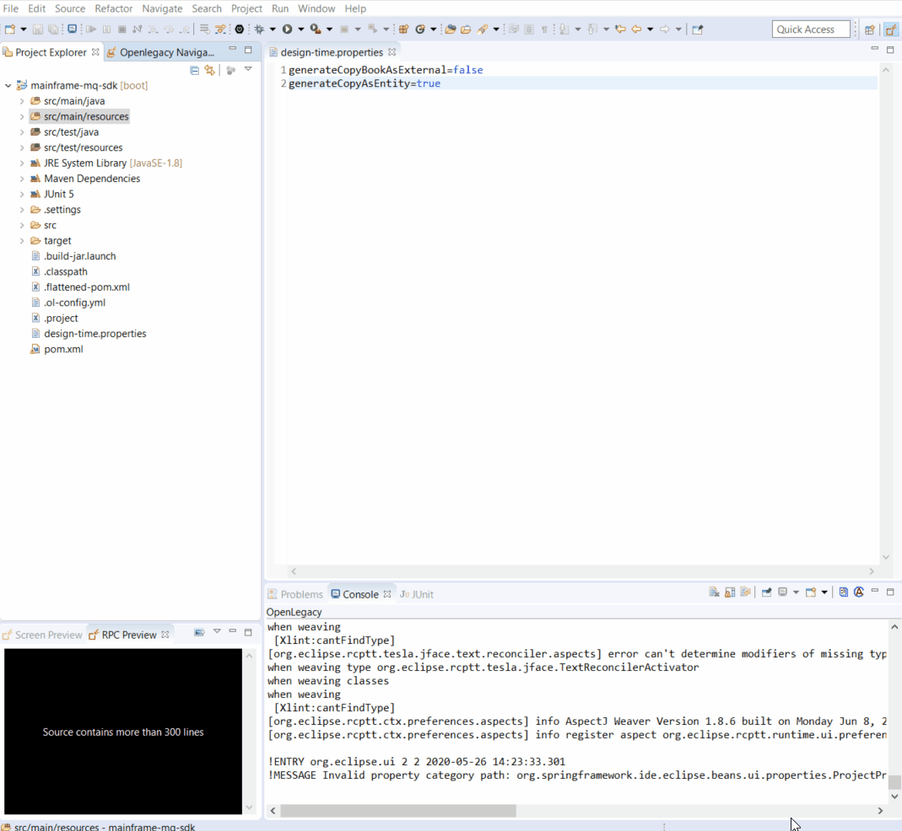
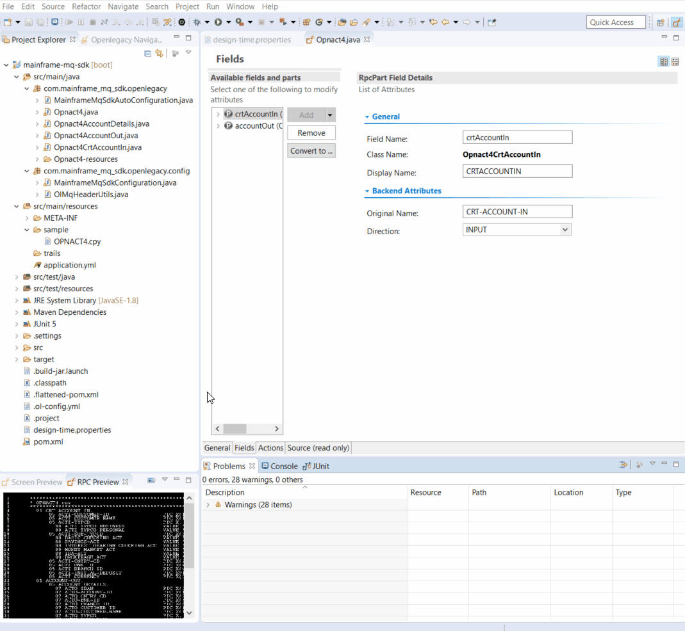
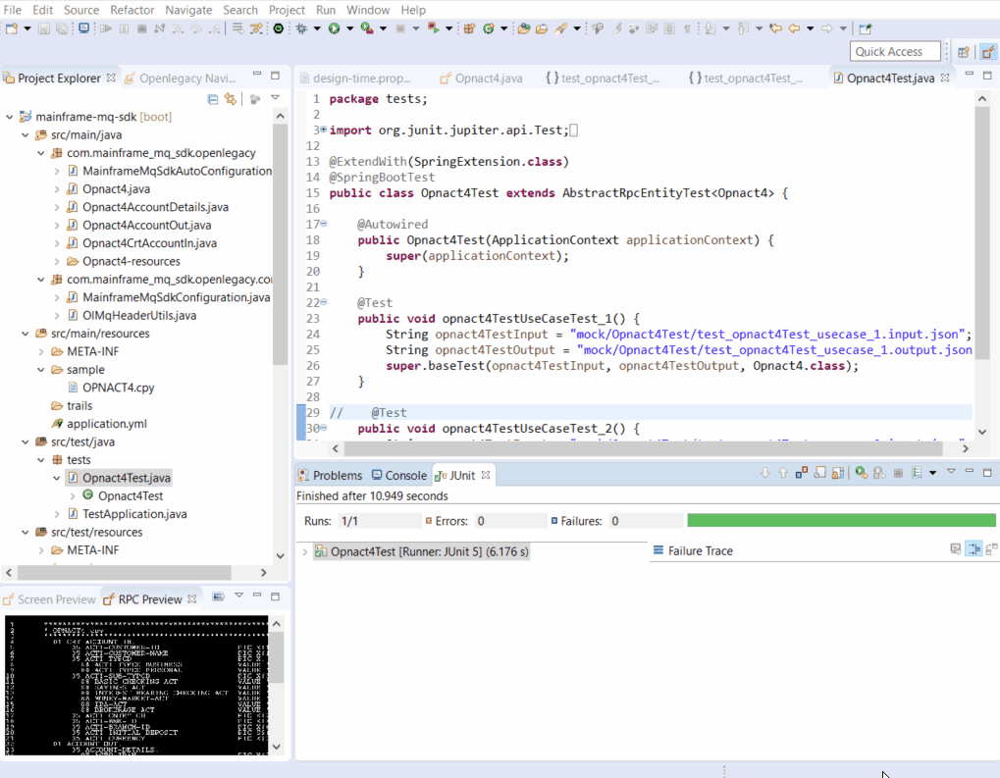
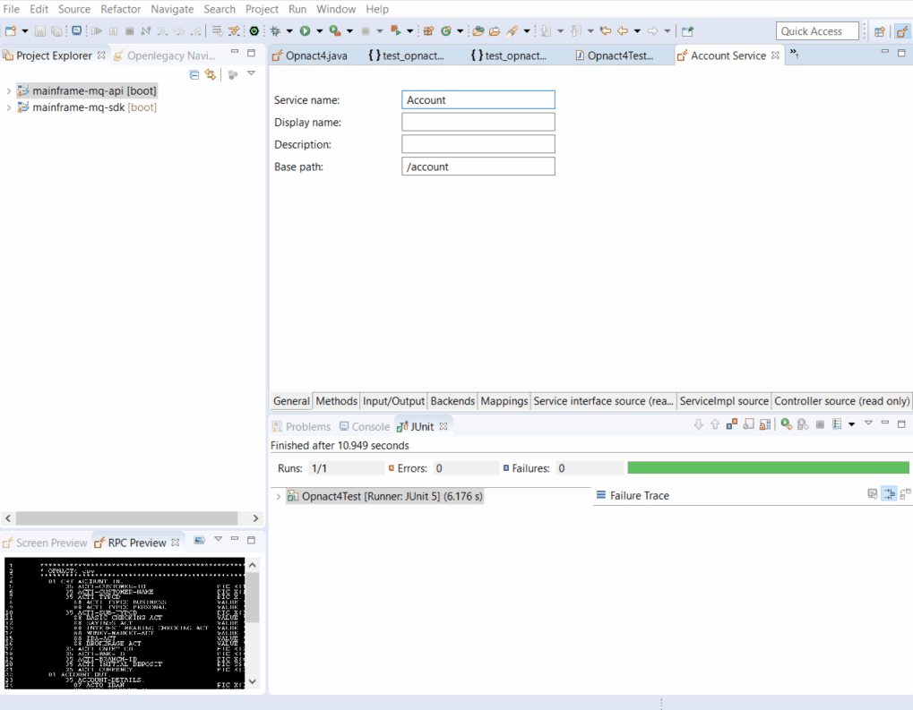

# REST API on top of IBM MQ

The following demo shows how to create an API to retrieve Item Details from a Mainframe COBOL program using IBM MQ.

## Pre-Requirements

- OpenLegacy IDE 4.6.5 (Full installation including JDK and all Maven dependencies)
- Internet Connection

## Demo Definition

- Create a new SDK Project.
- Generate Java entities from **Cobol source** file.
- Develop and run unit tests on the fly.
- Test the connectivity and data retrieval from the **Mainframe CICS Program**.
- Create an API project on the top of your SDK project.
  
## Demo Resources

- [OPNACT4.cpy](./assets/resources/OPNACT4.cpy)

## Step 1 – Create a New SDK Project

> First, we will create a new SDK project using the OpenLegacy IDE.
The purpose of the SDK project is to allow easy access to legacy backends, using standard and easy to use Java code.

1. Open the New Project Wizard:
   - File → New → OpenLegacy SDK Project
2. Define the **Project Name** as `mainframe-mq-sdk`.
3. Click in the **Default Package** field, to automatically populate it.
4. Select **IBM MQ** as the backend and click **Next**.
5. Set the connection details to the backendwith the following parameters:
    - **Host:** `192.86.32.238`
    - **Port:** `1414`
    - **Queue channel:** `CSQ9.SVRCONN`
    - **Queue manager:** `CSQ9`
    - **Input queue name:** `DEV.OUT.QUEUE`
    - **Output queue name:** `DEV.OUT.QUEUE`
6. Click **Finish**.
7. Open design-time.properties file located at `mainframe-mq-sdk`, change the **generateCopyAsEntity** value to `true` and save the file.



## Step 2 – Generate Java Model (entity) from the COBOL Source

1. Copy the following resource to your samples folder at `src/main/resources/sample`:
    - [OPNACT4.cpy](./assets/resources/OPNACT4.cpy).
2. **Right-Click** on the `OPNACT4.cpy` file → OpenLegacy → Generate Model.
3. Set **Execution Path** as `OPNACT4`.
4. Check **Generate JUnit Test checkbox**.
5. Click **OK**.
6. Using the RPC Part Editor, open the generated Java class at `src/main/java/com/mainframe_mq_sdk/openlegacy/Opnact4.java`.
7. Modify `crtAccountIn`'s Direction to `INPUT`.



## Step 3 - Configure IBM MQ Header Builder

> IBM MQ can be used very differently from one site to another. The main concept is that the Queue transfers the data to an underlying program to be called. The underlying program is often a dispatcher program that forwards the request to the relevant program based on certain headers. As the structure of these headers can vary in different facilities, OpenLegacy provides a place to configure a Header Builder using the `MqHeaderUtils` interface.
  
## Step 4 – Create a JUnit Test

> OpenLegacy enables test-driven development by auto-generating test suites for each backend program (entities).
The tests are auto-generated, and all you have to do is to provide a JSON format input and output to test against the backend.

1. Open and edit `src/test/resources/mock/Opnact4Test/test_opnact4Test_usecase_1.input.json` like this:  

  ```json
  {
    "crtAccountIn" : {
      "actiCustomerId" : "1003200330034003",
      "actiCustomerName" : "AMANDA LITTLE",
      "actiTypcd" : "P",
      "actiSubTypcd" : "S",
      "actiCntryCd" : "UK",
      "actiBnkId" : "0002",
      "actiBranchId" : "1234",
      "actiInitialDeposit" : 703.4,
      "actiCurrency" : "LBS"
    },
    "accountOut" : {
      "rtcd" : 0,
      "rtMsg" : "",
      "accountDetails" : {
        "actoIban" : "",
        "actoAccountId" : "",
        "actoCntryCd" : "",
        "actoBnkId" : "",
        "actoBranchId" : "",
        "actoCustomerId" : "",
        "actoCustomerName" : "",
        "actoTypcd" : "",
        "actoTypeName" : "",
        "actoSubTypcd" : "",
        "actoTypeDescription" : "",
        "actoBalance" : 0,
        "actoCurrency" : "",
        "actoCrtDt" : "",
        "actoUpdtDt" : "",
        "actoLocked" : ""
      }
    }
  }
  ```
  
2. Open `src/test/resources/mock/Opnact4Test/test_opnact4Test_usecase_1.output.json` and paste - [this](./assets/resources/Test_usecase_1.output.json) JSON content instead (replace everything)

  
3. Go to src/test/java/tests/Opnact4Test.java and comment out opnact4TestUseCaseTest_2.  
4. Run the JUnit by right-clicking on `Opnact4Test.java` → Run As → JUnit Tests.  
   If you followed all the steps correctly the tests should pass.



## Step 5 – Create APIs from SDK

1. Open the New Project Wizard:  
   - File → New → OpenLegacy API Project  
2. Define the **Project name** as `mainframe-mq-api`.  
3. Click in the **Default Package** field, to automatically populate it.  
4. Press Next and add the SDK project that was created in **Step 1**  as the reference project.  
5. **Right-Click** on the **Mainframe API** project → OpenLegacy → Generate API from SDK  

    - Name the service `Account`.  
    - Select `Opnact4` → `crtAccountIn` as input.  
    - Select the `accountOut` model as output.  
    - **Click OK**.




## Step 6 - Run and Test your API

1. **Right-click** on the **Mainframe API** project → OpenLegacy → Run Application  
2. Open the browser to http://localhost:8080/swagger  
3. Authorize through **Oauth2**
   - **Client Id:** `client_id`
   - **Client Secret:** `client_secret`
4. **Click** on the API we created → Try it out  
    - Set the input as following:  
	
      ```json
      {
        "crtAccountIn": {
          "actiCustomerId" : "1003200330034003",
          "actiCustomerName" : "AMANDA LITTLE",
          "actiTypcd" : "P",
          "actiSubTypcd" : "S",
          "actiCntryCd" : "UK",
          "actiBnkId" : "0002",
          "actiBranchId" : "1234",
          "actiInitialDeposit" : 703.4,
          "actiCurrency" : "LBS"
        }
      }
      ```
	  
    - You should see a successful response returned directly from the mainframe CICS program `Opnact4` using IBM MQ!  
	
      ```json
		{
		  "accountOut": {
			"accountDetails": {
			  "actoIban": "OPNACT4 1003200330034003AMANDA L",
			  "actoAccountId": "ITTLE   PS",
			  "actoCntryCd": "U",
			  "actoBnkId": "K000",
			  "actoBranchId": "21234",
			  "actoCustomerId": "ø”\fLBS",
			  "actoCustomerName": null,
			  "actoTypcd": null,
			  "actoTypeName": null,
			  "actoSubTypcd": null,
			  "actoTypeDescription": null,
			  "actoBalance": null,
			  "actoCurrency": null,
			  "actoCrtDt": null,
			  "actoUpdtDt": null,
			  "actoLocked": null
			},
			"rtcd": null,
			"rtMsg": null
		  }
		}
      ```  



## Summary

In this demo we presented an end to end integration with IBM MQ using Openlegacy IDE within just a couple of minutes.
We started from a COBOL source of a program we wanted to expose and automatically generated a Java SDK that enables calling the underlying program, using IBM MQ. We then  created a REST API utilizing the Mainframe IBM MQ SDK.
We used the IDE to better model and design the API and showed how it works with a standard Swagger page.
