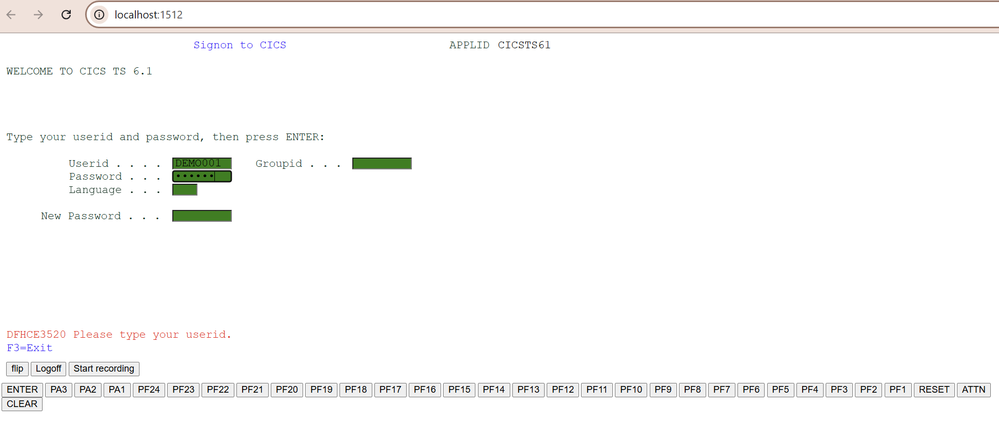

# Mainframe Screens Project Exercise


## Introduction

This exercise will develop your skills with the OpenLegacy IDE by creating simple Java entities from 3270 screens from a Mainframe host and then exposing them as a REST API to the digital world.

## Pre-Requirements

OpenLegacy IDE 4.6.12 (Full installation including JDK and all Maven dependencies).
Internet Connection

## Exercise Definition
  - Create a new SDK Project.
  - Record a trail file using OpenLegacy Screens Emulator.
  - Generate Java models (Screen Entities) from a trail file.
  - Define screens navigation to automate the flow between screen in run-time.
  - Develop JUnit tests on the fly.
  - Test the connectivity and data retrieval from the Mainframe host.
  - You will use JUnit tests to test the SDK and invoke the response.
  - Create a new API Project
  - Create an API Service from the SDK
  - Run & Test the API 

## Step 1 – Create a New SDK Project

First we will create a new SDK project using the OpenLegacy IDE.
The purpose of the SDK project is to allow easy access to legacy backends, using standard and easy to use Java code.

**Project Setup**

Create a new OpenLegacy Mainframe Screens project.

1. Open New Project Wizard:
   - File → New → OpenLegacy SDK Project
2. Define the project name as `mainframe-screens-sdk` and click at the Default Package field, to automatically fill it up.
3. Select Mainframe Screens as the backend and click Next
4. Enter the Mainframe information:
   - Host Name/IP: mainframe.openlegacy.com
   - Host Port: 623
   - Code Page: 37

> **_NOTE:_**   These credentials can be easily edited through the properties file located at `src/main/resources/application.yml` file.


5. Click **Finish**


**Testing the Configuration**
   1. Make sure your environment has no errors.
   2. Do a Maven update if needed.
   3. Do a project -> clean if needed (not Maven clean).


## Step 2 – Record a Trail File Using OpenLegacy Screens Emulator
In this step we will record the screens flow - the result will be a trail file.
The Trail file has two purposes:

* The Trail file is a resource required when generating the entities, it contains all the metadata required to accurately describe the legacy screens to allow the creation of the Java models that will be used in the live application
* The Trail file is a replication of the real host screens that can be used as a mock-up to run the project for testing or other purposes, without connecting to the live host

1. Right click on the SDK project→ OpenLegacy → Run emulation
    > **_NOTE:_** This will open up a terminal connection to the host that can be accessed at http://localhost:1512 via a web browser

2. Type **`CICS`** and press **enter**


3. In the following screen press **Escape**:


4. Type **`INQ1`** and press **Enter**.


5. Inside **Loan Number** field type: `1000` and press **Enter**


6. You should receive the following - click **Logoff**.


    > **_NOTE:_** A Trail file has been created in  `src/test/resources/trails`.


## Step 3 – Generate Java Models From a Trail File
In this step we will create our Java models from the recorded trail file.

1. Go back to the IDE

2. Right click on the project→ Refresh
3. A popup window will appear:


   - Click **Yes**

4. Another popup window will appear:

      

   - Mark **Generate JUnit test** checkbox
   - Click **OK**

    Screen entities are Plain Java Objects that are used as models for the terminal screens. 
    Each screen entity is defined by three properties:

   * Identifiers - Contains the unique properties of the screen which differentiate it from other screens, and allow to identify it.
   * Navigation - Contains metadata about how to navigate to this screen.
   * Fields - Creates the relationship between the Java field to the exact position the field is located on the terminal screen.
In this step we are going to define our screen entities, their fields and Identifiers

> **_NOTE:_** You may see that most of the process is well automated, we do recommend to review the screen entities and make sure that we use unique **Identifiers**
for the newly created entities


5. Click OK at each one of the windows to close them.

    > **_NOTE:_** The entities are created in `src/main/java`.

6. Go to the trail file created at ```/mainframe-screens-sdk/src/test/resources/trails```
    1. Right click on Screen1 (IN) -> Generate Screen Model
    2. Generate Model popup will appear, check Generate JUnit Test and click **OK**
    3. Enter `Welcome` at Entity Name
    4. Double click on row 24 
    5. Click on the `S` orange icon to add string field
    6. Double click on `Welcome To The` text and click on `+` button to add identifier
    7. Double click on `IBM Innovation Center - Dallas` text and click on `+` button to add identifier
    8. Click OK
    


7.
    1. Right click on Screen3 (IN) -> Generate Screen Model
    2. Generate Model popup will appear, check Generate JUnit Test and click **OK**
    3. Enter `CICS` at Entity Name
    4. Mark `WELCOME TO CICS` text and click on `+` button to add identifier (make sure row is 1 and column is 2)
    5. Mark `(R)` text and click on `+` button to add identifier (make sure row is 7 and column is 57)
    6. Click OK
    


8.
    1. Right click on Screen5 (IN) -> Generate Screen Model
    2. Generate Model popup will appear, check Generate JUnit Test and click **OK**
    3. Enter `EmptyScreen` at Entity Name
    4. Double click on row 3, and click on `+` button to add identifier
    5. Double click on row 5, and click on `+` button to add identifier
    6. Double click on row 7, and click on `+` button to add identifier
    7. Double click on row 1, and click on the `S` orange icon to add string field
    8. Click OK


## Step 4 – Define Screen Navigation
In this step we will set the navigation metadata for each screen so the SDK will be able to navigate to the relevant screen automatically whenever we would like to fetch it.
In run-time, when the application starts, OpenLegacy builds a tree representing the navigation between all the entities.

1. Open **CICS.java** class with the Entity editor
	  -  Go to **General** tab at the bottom → @ScreenNavigation
	  -  Select **Welcome** in **Accessed from** attribute
	  -  Under **Assigned Fields** fill the next:

         
     - Click **Save**

2. Open **EmptyScreen.java** class with the Entity editor
    - Go to **General** tab → @ScreenNavigation
    - Select **CICS** in **Accessed from** attribute
    - Select **ESCAPE** in the **Terminal Action** attribute.

      
    - Click **Save**

   >Terminal action - this is the action or key to click in the previous   screen so   as to access the present   screen. If **Accessed From** attribute was set, then the **Terminal Action** attribute is **ENTER** by default. You can   click the drop down   arrow to see the   list of available   keys, or Browse to   search for a   specific key.

3. Open **Loaninq1.java** class with the Entity editor
	 - Go to **General** tab → @ScreenNavigation
	 - Select **EmptyScreen** in **Accessed from** attribute
     - Select **F12** in the **Exit action** attribute
     - Under **Assigned Fields** fill the next:
      
        
	 - Click **Save**

4. Open **Loaninq2.java** class with the Entity editor
    - Go to **General** tab → @ScreenNavigation
    - Select **F12** in the **Exit action** attribute.
    - Select **Loaninq1** in **Accessed from** attribute
    - Take off loanNumber from **Assigned Fields**
    - Click **Save**


5. Open **Welcome.java** class with the Entity editor
    - Go to **Fields** tab, change **Field Name** to `commandLine1` and **Display Name** to `Command Line 1`
    - Click **Save**


 > **_NOTE:_** Accessed from - this is the name of the previous screen from which       the present screen is accessed. You can click the drop down arrow to see the list       of available screens, or Browse to search for a specific screen. Assigned       fields -  when the navigation to the present screen requires specific values to be       specified in fields on the Accessed from screen, these fields need to be added as       an array to the Assigned Fields attribute.

## Step 5 – Create a JUnit Test
By default, when generating a Java model (entity), a JUnit test is automatically generated.
We can extend this test suite with additional unit tests to validate our connectivity to the backend.

1. Go to `src/test/java/tests/`
2. Right click on **_[TRAIL-FILE-RANDOM-NAME]Test.java** -> **Run As** -> **JUnit Test**

 > **_NOTE:_** Highly recommended to put your project to debug level in order to see the screen flow. In order to do that, go to application.yml and add the following snippet:
   ```yml
   logging:
     level:
        org.openlegacy: debug
   ```


## Step 6 – Create API
1. Open the New Project Wizard:
   - File → New → OpenLegacy API Project
2. Define the **Project name** as `mainframe-screens-api`.
3. Click at the **Default Package** field, to automatically fill it up.
4. Press Next and add the SDK project that was created in **Step 1**  as the reference project.
5. **Right-Click** on the `mainframe-screens-api` project → OpenLegacy → Generate API from SDK
    - Name the service `Loan`
    - Select from the `Loaninq1` model the `Loannumber` as input
    - Select `Loaninq2` model as output
    - **Click OK**


## Step 7 - Run and Test your API

- Before running the API, open **pom.xml** file located in **mainframe-screens-api** project and remove the following lines:
```JAVA
        <dependency>
            <groupId>org.openlegacy</groupId>
            <artifactId>openlegacy-api-logging</artifactId>
            <version>${openlegacy.version}</version>
        </dependency>
``` 
1. **Right-Click** on the **mainframe-screens-api** project → OpenLegacy → Run Application
2. Open the browser on http://localhost:8080/swagger
3. Authorize through **Oauth2**
   - **Client Id:** `client_id`
   - **Client Secret:** `client_secret`
4. **Click** on the API we've created → Try it out

   1. Set a loanNumber to 1000
   2. You should see successful response returned directly from the Mainframe Screens program


# Summary 

In this demo we have presented an end to end integration with Mainframe Screens using Openlegacy IDE within just a couple of minutes.
We have started from an emulation that entered into the Mainframe server and generated models from trail files that enables calling the underlying program. 
Later on, we've defined a screens flow for run-time and presented the creation of a REST API utilizing the Mainframe CICS SDK.
We used the IDE to better model and design the API and showed how it works with a standard Swagger page.
