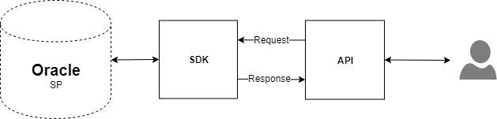

# How To Create Banking Oracle DB SP API 

### Introduction 
This demo shows generation of Java models from **ORACLE SQL Stored Procedures** using OpenLegacy IDE's built in **ORACLE SQL Stored Procedures**, and how to expose it as a **REST API**.

## Pre-Requirments
- OpenLegacy IDE 4.6.12 (Full installation including JDK and all Maven dependencies).
- Internet Connection.

## Demo Definition

- Creation of a new SDK Project.
- Import **ORACLE SQL Stored Procedure** using **Oracle SQL Procedure Fetcher**.
- Develop and run unit tests on the fly.
- Test the connectivity and data retrieval from the **ORACLE SQL Stored Procedure**.
- Creation of an API Project on the top of your SDK Project.

## Step 1 – Create a New SDK Project

> First, we will create a new SDK project using the OpenLegacy IDE.
The purpose of the SDK project is to allow easy access to legacy backends, using standard and easy to use Java code.

1. Open the New Project Wizard:
   - File → New → OpenLegacy SDK Project
2. Define the **Project Name** as `account-oracle-db-sdk`.
3. Click at the **Default Package** field, to automatically fill it up.
4. Select **Stored Procedures** as the backend and click **Next**.
5. From the **drop-down menu** , choose **Oracle**.
6. Enter the following database credentials:
   - **Database URL:** `jdbc:oracle:thin:@//oracle.openlegacy.com/ORCL`
   - **Database Username:** `openlegacy_team`
   - **Database Password:** `gp#6KN!yBiV`
7. Click **Finish**

## Step 2 – Generate Java Model (Entity) from Stored Procedure

> Now, we will create Java models out of our Stored Procedure we wish to expose.

1. Right click on the project → OpenLegacy → Import Oracle Stored Procedure
2. Click on **Fetch metadata** and wait until our fetcher returns the data of the Stored Procedures that exist on the Oracle DB.
3. From the drop-down of **Database schema** choose **OPENLEGACY_TEAM**
4. From the drop-down of **Database package** choose **BANK_ACCOUNTS_PACKAGE**
5. From the drop-down of **Stored procedure** choose **RESET_CUSTOMER_BANK_ACCOUNTS**
6. Check **Generate JUnit Test checkbox**.
7. Click **OK**.
8. Repit steps 1-7 for the following **Stored Procedures:** `GET_ALL_CUSTOMER_BANK_ACCOUNTS`, `OPEN_ACCOUNT`, `UPDATE_ACCOUNT`, `GET_ACCOUNT`, `DELETE_ACCOUNT`. 

## Step 3 – Create a JUnit Test

> OpenLegacy enables test-driven development by auto-generating test suites for each backend program (entities).
We can extend this test suite with additional unit tests to validate our connectivity to the backend.

- **Reset Accounts**
1. Go to `ResetCustomerBankAccountsTest` and comment the second test. 
2. Right-click on the test and `run as JUnit test`. 

- **Get All Customer Bank Account**
1. Go to `GetAllCustomerBankAccountsTest` and comment the second test. 
2. Right-click on the test and `run as JUnit test`. 

- **Open Account** 
1. Go to `/account-oracle-sdk/src/test/resources/mock/GetAccountTest/test_getAccountTest_usecase_1.input.json`
And replace it with the following JSON: [open-account-input json](./assets/resources/test_openAccountTest_usecase_1.input.json). 
2. Go to `/account-oracle-sdk/src/test/resources/mock/GetAccountTest/test_getAccountTest_usecase_1.output.json`  And replace it with the following JSON: [open-account-output json](./assets/resources/test_openAccountTest_usecase_1.output.json). 

3. Go to `OpenAccountTest` and comment the second test. 
4. Right-cllck on the test and `run as JUnit test`. 

- **Update Account** 
1. Go to `/account-oracle-sdk/src/test/resources/mock/UpdateAccountTest/test_updateAccountTest_usecase_1.input.json`
And replace it with the following JSON: [update-account-input json](./assets/resources/test_updateAccountTest_usecase_1.output.json). 
2. Go to `/account-oracle-sdk/src/test/resources/mock/UpdateAccountTest/test_updateAccountTest_usecase_1.output.json`  And replace it with the following JSON: [update-account-output json](./assets/resources/test_updateAccountTest_usecase_1.output.json). 

3. Go to `UpdateAccountTest` and comment the second test. 
4. Right-click on the test and `run as JUnit test`. 

- **Get Account**

1. Go to `/account-oracle-sdk/src/test/resources/mock/GetAccountTest/test_getAccountTest_usecase_1.input.json` And replace it with the following JSON: [get-account-input json](./assets/resources/test_getAccountTest_usecase_1.input.json). 
2. Go to `/account-oracle-sdk/src/test/resources/mock/GetAccountTest/test_getAccountTest_usecase_1.output.json` And replace it with the following JSON: [get-account-output json](./assets/resources/test_getAccountTest_usecase_1.output.json). 
3. Go to `GetAccountTest` and comment the second test. 
4. Right-click on the project and `run as JUnit test`. 

- **Delete Account** 
1. Go to `/account-oracle-sdk/src/test/resources/mock/DeleteAccountTest/test_deleteAccountTest_usecase_1.input.json` And replace it with the following JSON: [delete-account-input json](./assets/resources/test_deleteAccountTest_usecase_1.input.json). 
3. Go to `DeleteAccountTest` and comment the second test. 
4. Right-click on the project and `run as JUnit test`. 

## Step 4 – Create APIs from SDK

1. Open the New Project Wizard:
   - File → New → OpenLegacy API Project.
2. Define the project name as `account-oracle-db-api`.
3. Click at the **Default Package** field, to automatically fill it up.
4. Press Next and add the SDK project that was created in **Step 1**  as the reference project.

5. Create services from the SDK's entities. 
- **Reset Accounts**
   - **Right click** on the project and navigate to Openlegacy → Generate API from SDK
   - Define the Service name as `ResetAccounts`.
   - Set `ResetCustomerBankAccounts` as output.
   - Click **OK**.
- **Get All Customer Bank Account**
   - **Right click** on the project and navigate to Openlegacy → Generate API from SDK
   - Define the Service name as `GetAllCustomerAccountListService`.
   - Set `GetAllCustomerBankAccounts` as output.
   - Click **OK**.
- **Open Account**
   - **Right click** on the project and navigate to Openlegacy → Generate API from SDK
   - Define the Service name as `OpenAccount`.
   - Set all of the field inside `OpenAccount` instead of `bankAccountObj` as input.
   - Set `OpenAccount` → `bankAccountObj` as output.
   - Click **OK**.
- **Update Account** 
   - **Right click** on the project and navigate to Openlegacy → Generate API from SDK
   - Define the Service name as `UpdateAccount`.
   - Set all of the field inside `UpdateAccount` instead of `bankAccountObj` as input.
   - Set `UpdateAccount` → `bankAccountObj` as output.
   - Click **OK**.
- **Get Account** 
   - **Right click** on the project and navigate to Openlegacy → Generate API from SDK
   - Define the Service name as `GetAccount`.
   - Set `GetAccount` → `paccountId` as input.
   - Set `GetAccount` → `pbankAccountObj` as output.
   - Click **OK**.
- **Delete Account** 
   - **Right click** on the project and navigate to Openlegacy → Generate API from SDK
   - Define the Service name as `DeleteAccount`.
   - Set `DeleteAccount` → `paccountId` as input.
   - Set `DeleteAccount` as output.
   - Click **OK**.

## Step 5 - Run and Test your API

1. **Right-Click** on the API project → OpenLegacy → Run Application
2. Open the browser on http://localhost:8080/swagger
3. Authorize through **Oauth2**
   - **Client Id:** `client_id`
   - **Client Secret:** `client_secret`
4. Test the API
- **Click** on the  
​`/api​/resetaccount` → Try it out and click **Execute**.
-  **Click** on the  
​`/api/getallcustomeraccountlist` → Try it out and click **Execute**.
- **Click** on the  `/api/openaccount` → Try it out, use the following json as input -  [open-account-input json](./assets/resources/test_openAccountTest_usecase_1.input.json), and **Execute**. 
-  **Click** on the  `/api​/updateaccount` Try it out, use the following json as input -  [update-account-input json](./assets/resources/test_updateAccountTest_usecase_1.output.json) , and **Execute**. 

-  **Click** on the `/api​/getaccount` Try it out, use the following json as input - [get-account-output json](./assets/resources/test_getAccountTest_usecase_1.output.json), and **Execute**. 

- **Click** on the `/api/deleteaccount` Try it out, use the following json as input - [delete-account-input json](./assets/resources/test_deleteAccountTest_usecase_1.input.json)., and **Execute**. 

   - You should see successful response returned directly from the Oracle SQL Server Stored Procedure!

   

## Summary

In this demo we have presented an end to end integration with **Oracle SQL Server** using OpenLegacy IDE within just a couple of minutes. We have started with fetching procedure metadata from an Oracle SQL Server, based on the metadata we automatically generated Java SDK that enables calling the Stored Procedure, later on we have presented the creation of a REST API utilizing the Oracle SQL Stored Procedure SDK.
We used the IDE to better model and design the API and showed how it works with a standard Swagger page.   
