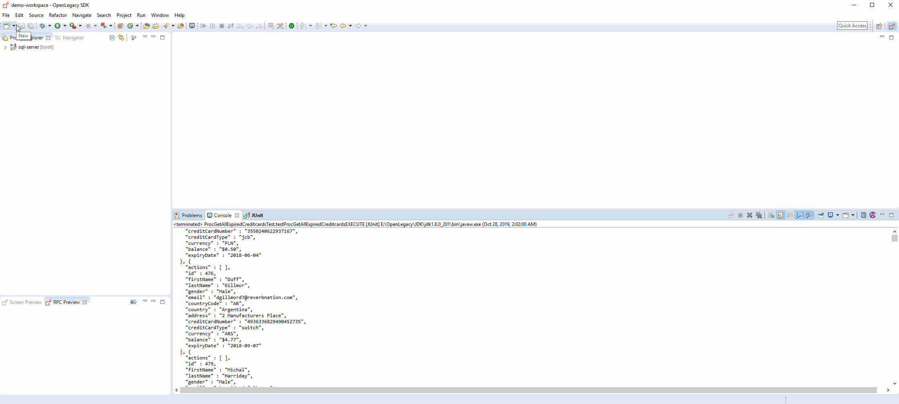
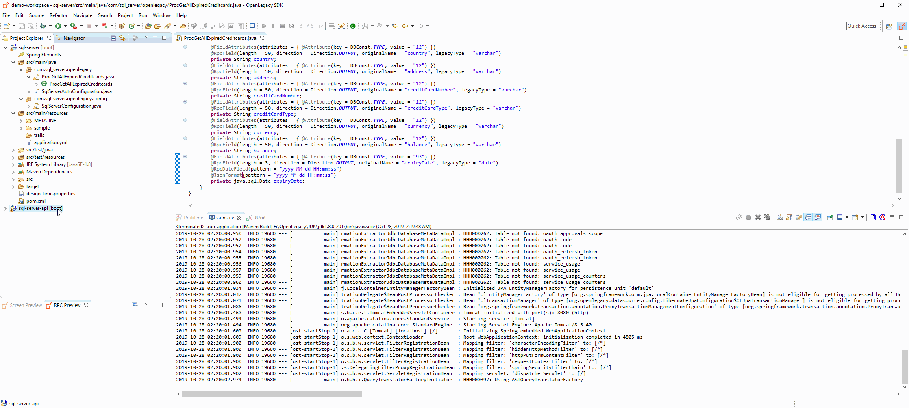

# Expose MS SQL Stored Procedure as a REST API

## Introduction

This demo shows generation of Java models from **MS SQL Stored Procedure** using OpenLegacy IDE's built in **MS SQL Procedure Fetcher**, and how to expose it as a **REST API**.

## Architecture


## Pre-Requirements

- OpenLegacy IDE 4.6.12 (Full installation including JDK and all Maven dependencies)
- Internet Connection

## Demo Definition

- Creation of a new SDK Project.
- Import **MS SQL Procedure** using **MS SQL Procedure Fetcher**.
- Develop and run unit tests on the fly.
- Test the connectivity and data retrieval from the **Microsoft SQL Server**.
- Creation of an API Project on the top of your SDK Project.

## Step 1 – Create a New SDK Project

> First, we will create a new SDK project using the OpenLegacy IDE.
The purpose of the SDK project is to allow easy access to legacy backends, using standard and easy to use Java code.

1. Open the New Project Wizard:
   - File → New → OpenLegacy SDK Project
2. Define the **Project Name** as `microsoft-sqlserver-sp-sdk`.
3. Click at the **Default Package** field, to automatically fill it up.
4. Select **Stored Procedures** as the backend and click **Next**.
5. From the **drop-down menu** , choose **Microsoft SQL Server**.
6. Enter the following database credentials:
   - **Database URL:** `jdbc:sqlserver://solutions.openlegacy.com:1433`
   - **Database Username:** `sa`
   - **Database Password:** `Open1egacy`
7. Click **Finish**


## Step 2 – Generate Java Model (Entity) from Stored Procedure

> Now, we will create Java models out of our Stored Procedure we wish to expose.

1. Right click on the project → OpenLegacy → Import MS SQL Stored Procedure/Function
2. Click on **Fetch metadata** and wait until our fetcher returns the list of stored procedures that exist and viewable for the user in the MS SQL Server.
3. From the drop-down of **Stored procedure / function** choose **proc_get_all_expired_creditcards**
4. Check **Generate JUnit Test checkbox**.
5. Click **OK**.
6. After the successful generation of the `ProcGetAllExpiredCreditcards.java` with **Rpc Entity Editor**:
   1. Go to **Fields**
   2. Choose `expiryDate` and change **Pattern** to `yyyy-MM-dd HH:mm:ss`.
7. Within the regular java editor:
   1. Go to `resultSet` → `expiryDate`.
   2. Replace `private Date expiryDate;` with `private java.sql.Date expiryDate;`.
   3. Add the following annotation: `@JsonFormat(pattern = "yyyy-MM-dd HH:mm:ss")`.
   4. Remove the following annotation: `@RpcDateField(pattern = "yyyy-MM-dd HH:mm:ss")` (if needed).
   5. Maven clean and maven install. 


## Step 3 – Create a JUnit Test

> OpenLegacy enables test-driven development by auto-generating test suites for each backend program (entities).
We can extend this test suite with additional unit tests to validate our connectivity to the backend.

1. Open `src/test/resources/mock/ProcGetAllExpiredCreditcardsTest/test_procGetAllExpiredCreditcardsTest_usecase_1.output.json` and paste the following JSON from below as the expected output:
   <details>
       <summary>Click here to see the JSON File</summary>
   
   ```json
      {
        "resultSet" : [ {
          "id" : 2,
          "firstName" : "Roth",
          "lastName" : "Ladell",
          "gender" : "Male",
          "email" : "rladell1@washingtonpost.com",
          "countryCode" : "SE",
          "country" : "Sweden",
          "address" : "9 Jay Trail",
          "creditCardNumber" : "3552496324488267",
          "creditCardType" : "jcb",
          "currency" : "Krona",
          "balance" : null,
          "expiryDate" : "2020-11-26 22:00:00"
        }, {
          "id" : 3,
          "firstName" : "Brennen",
          "lastName" : "Malden",
          "gender" : "Male",
          "email" : "bmalden2@fema.gov",
          "countryCode" : "PT",
          "country" : "Portugal",
          "address" : "5436 Harper Trail",
          "creditCardNumber" : "36641018014687",
          "creditCardType" : "diners-club-international",
          "currency" : "Euro",
          "balance" : null,
          "expiryDate" : "2019-11-22 22:00:00"
        }, {
          "id" : 4,
          "firstName" : "Stacia",
          "lastName" : "Augustin",
          "gender" : "Female",
          "email" : "saugustin3@tmall.com",
          "countryCode" : "PE",
          "country" : "Peru",
          "address" : "58488 Cardinal Alley",
          "creditCardNumber" : "56022307178911348",
          "creditCardType" : "china-unionpay",
          "currency" : "Sol",
          "balance" : null,
          "expiryDate" : "2019-07-22 21:00:00"
        }, {
          "id" : 5,
          "firstName" : "Renard",
          "lastName" : "Brigg",
          "gender" : "Male",
          "email" : "rbrigg4@apache.org",
          "countryCode" : "TJ",
          "country" : "Tajikistan",
          "address" : "652 Corry Crossing",
          "creditCardNumber" : "4026899613873998",
          "creditCardType" : "visa-electron",
          "currency" : "Somoni",
          "balance" : null,
          "expiryDate" : "2019-10-01 21:00:00"
        }, {
          "id" : 6,
          "firstName" : "Tessa",
          "lastName" : "Eads",
          "gender" : "Female",
          "email" : "teads5@51.la",
          "countryCode" : "PT",
          "country" : "Portugal",
          "address" : "9 Parkside Hill",
          "creditCardNumber" : "4911735439689683023",
          "creditCardType" : "switch",
          "currency" : "Euro",
          "balance" : null,
          "expiryDate" : "2020-02-17 22:00:00"
        }, {
          "id" : 8,
          "firstName" : "Lilith",
          "lastName" : "Saundercock",
          "gender" : "Female",
          "email" : "lsaundercock7@latimes.com",
          "countryCode" : "CN",
          "country" : "China",
          "address" : "9989 Randy Court",
          "creditCardNumber" : "3550435428941922",
          "creditCardType" : "jcb",
          "currency" : "Yuan Renminbi",
          "balance" : null,
          "expiryDate" : "2020-12-25 22:00:00"
        }, {
          "id" : 9,
          "firstName" : "Prudi",
          "lastName" : "Anneslie",
          "gender" : "Female",
          "email" : "panneslie8@rakuten.co.jp",
          "countryCode" : "HN",
          "country" : "Honduras",
          "address" : "872 Esker Alley",
          "creditCardNumber" : "201557551131085",
          "creditCardType" : "diners-club-enroute",
          "currency" : "Lempira",
          "balance" : null,
          "expiryDate" : "2021-06-01 21:00:00"
        }, {
          "id" : 10,
          "firstName" : "Kean",
          "lastName" : "Ackenson",
          "gender" : "Male",
          "email" : "kackenson9@vimeo.com",
          "countryCode" : "SV",
          "country" : "El Salvador",
          "address" : "6571 Prairieview Place",
          "creditCardNumber" : "4936985221369090172",
          "creditCardType" : "switch",
          "currency" : "Dollar",
          "balance" : null,
          "expiryDate" : "2021-05-23 21:00:00"
        }, {
          "id" : 12,
          "firstName" : "Diana",
          "lastName" : "Arstingall",
          "gender" : "Female",
          "email" : "darstingallb@flavors.me",
          "countryCode" : "HR",
          "country" : "Croatia",
          "address" : "2 Del Mar Road",
          "creditCardNumber" : "3531451135666284",
          "creditCardType" : "jcb",
          "currency" : "Kuna",
          "balance" : null,
          "expiryDate" : "2019-03-14 22:00:00"
        }, {
          "id" : 13,
          "firstName" : "Jeno",
          "lastName" : "Fadian",
          "gender" : "Male",
          "email" : "jfadianc@moonfruit.com",
          "countryCode" : "ID",
          "country" : "Indonesia",
          "address" : "064 Porter Park",
          "creditCardNumber" : "3583881269291219",
          "creditCardType" : "jcb",
          "currency" : "Rupiah",
          "balance" : null,
          "expiryDate" : "2020-06-22 21:00:00"
        }, {
          "id" : 14,
          "firstName" : "Lanie",
          "lastName" : "Sennett",
          "gender" : "Male",
          "email" : "lsennettd@lulu.com",
          "countryCode" : "ID",
          "country" : "Indonesia",
          "address" : "3 Talmadge Park",
          "creditCardNumber" : "5610379934411793",
          "creditCardType" : "china-unionpay",
          "currency" : "Rupiah",
          "balance" : null,
          "expiryDate" : "2020-01-05 22:00:00"
        }, {
          "id" : 15,
          "firstName" : "Josepha",
          "lastName" : "Bratcher",
          "gender" : "Female",
          "email" : "jbratchere@webs.com",
          "countryCode" : "BD",
          "country" : "Bangladesh",
          "address" : "155 Fieldstone Pass",
          "creditCardNumber" : "201655075163087",
          "creditCardType" : "diners-club-enroute",
          "currency" : "Taka",
          "balance" : null,
          "expiryDate" : "2021-02-27 22:00:00"
        }, {
          "id" : 17,
          "firstName" : "Jemmy",
          "lastName" : "Cressingham",
          "gender" : "Female",
          "email" : "jcressinghamg@usnews.com",
          "countryCode" : "US",
          "country" : "United States",
          "address" : "40 Macpherson Center",
          "creditCardNumber" : "3569386799227244",
          "creditCardType" : "jcb",
          "currency" : "Dollar",
          "balance" : null,
          "expiryDate" : "2019-06-24 21:00:00"
        }, {
          "id" : 18,
          "firstName" : "Aubrey",
          "lastName" : "Marte",
          "gender" : "Male",
          "email" : "amarteh@bbb.org",
          "countryCode" : "PH",
          "country" : "Philippines",
          "address" : "284 Doe Crossing Circle",
          "creditCardNumber" : "3553360849055929",
          "creditCardType" : "jcb",
          "currency" : "Peso",
          "balance" : null,
          "expiryDate" : "2021-05-21 21:00:00"
        }, {
          "id" : 19,
          "firstName" : "Charley",
          "lastName" : "Giovani",
          "gender" : "Male",
          "email" : "cgiovanii@ucla.edu",
          "countryCode" : "NI",
          "country" : "Nicaragua",
          "address" : "975 Becker Center",
          "creditCardNumber" : "3552791052094331",
          "creditCardType" : "jcb",
          "currency" : "Cordoba",
          "balance" : null,
          "expiryDate" : "2021-01-20 22:00:00"
        }, {
          "id" : 20,
          "firstName" : "Raine",
          "lastName" : "Osman",
          "gender" : "Female",
          "email" : "rosmanj@paginegialle.it",
          "countryCode" : "EG",
          "country" : "Egypt",
          "address" : "80623 Bayside Road",
          "creditCardNumber" : "3583808032766292",
          "creditCardType" : "jcb",
          "currency" : "Pound",
          "balance" : null,
          "expiryDate" : "2020-08-05 21:00:00"
        } ]
      }

   ```
   </details>    
2. Run the JUnit by Right Clicking on the project -> Run As -> JUnit Tests. The expected result is two tests passing.

## Step 4 – Create APIs from SDK

1. Open the New Project Wizard:
   - File → New → OpenLegacy API Project.
2. Define the project name as `microsoft-sqlserver-sp-api`.
3. Click at the **Default Package** field, to automatically fill it up.
4. Press Next and add the SDK project that was created in **Step 1**  as the reference project.
5. Right click on the project and navigate to Openlegacy → Generate API from SDK
6. Define the Service name as `ExpiredCards`.
7. Open the SDK folder
8. Add the **ProcGetAllExpiredCreditCards** to the **Output box** then click **OK**.



## Step 5 - Run and Test your API


1. **Right-Click** on the **microsoft-sqlserver-sp-api** project → OpenLegacy → Run Application
2. Open the browser on http://localhost:8080/swagger
3. **Click** on the API we've created → Try it out
   - You should see successful respond returned directly from the MS SQL Server Stored Procedure!
     ```json
     {
       "resultSet": [
         {
           "id": 2,
           "firstName": "Thom",
           "lastName": "Virgin",
           "gender": "Male",
           "email": "tvirgin1@toplist.cz",
           "country": "Indonesia",
           "address": "03 West Court",
           "creditCardNumber": "3564371629217628",
           "creditCardType": "jcb",
           "currency": "IDR",
           "balance": "$5.73",
           "expiryDate": "2017-04-17 21:00:00"
         }
      ]
     }
     ```



## Summary

In this demo we have presented an end to end integration with **MS SQL Server** using OpenLegacy IDE within just a couple of minutes. We have started with fetching procedure metadata from a MS SQL Server, based on the metadata we automatically generated Java SDK that enables calling the Stored Procedure, later on we have presented the creation of a REST API utilizing the MS SQL Stored Procedure SDK.
We used the IDE to better model and design the API and showed how it works with a standard Swagger page.
